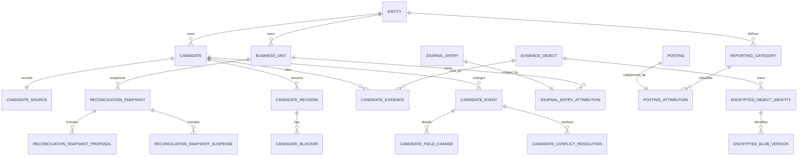

# R1 database schema and grants design

Status: APPROVED FOR DESIGN DOCS COMMIT; design only. This approval authorizes
committing the design documents only; it authorizes no migration, production
role, database read, or real-data enablement.

## Purpose

This design defines the first PostgreSQL-backed Core read model that can replace
the packaged R1 fixture after separate implementation and operational gates. It
preserves the R0/R1 wire contract while making Candidate history, evidence
lineage, reconciliation snapshots, and POSTED ledger summaries database facts.

The design follows these existing invariants:

- Core remains the only owner of real financial facts. Web and other callers use
  the mTLS internal API and never connect to PostgreSQL.
- The migration owner is absent from API, worker, and reader runtimes.
- Runtime roles have no owner membership, `SET ROLE`, `TEMPORARY`, schema
  creation, trigger control, or direct `audit_event` insert capability.
- Audit writes use allowlisted `SECURITY DEFINER` functions with
  `search_path=pg_catalog` and schema-qualified object names.
- Candidate and reconciliation state is append-only or forward-only; POSTED
  ledger facts remain immutable.
- S1 key material remains outside PostgreSQL. The database stores encrypted
  envelope metadata, not KEKs or plaintext DEKs.

## Confirmed decisions

1. Candidate truth is a complete immutable revision history plus typed domain
   events; a mutable current row is not the sole fact.
2. R1 uses a new `ledgerbridge_reader` login. It does not reuse
   `ledgerbridge_api` and receives no business-table write grants.
3. Ledger summaries aggregate live POSTED facts. Reconciliation uses immutable
   snapshots.
4. A `business_unit` has a UUID identity and stable entity-scoped `ref`.
5. Evidence owns an immutable entity and business unit. A Candidate with an
   assigned business unit may reference only evidence in that exact scope.
6. A Candidate whose business unit is still null may reference evidence from
   the same entity. This does not grant evidence download: download authorization
   still uses the evidence object's own business unit.
7. Encrypted blob rotations append a new version referencing its predecessor;
   old versions are not overwritten.
8. Reporting categories are independent, entity-scoped dimensions. They are
   not account identifiers or Candidate categories.
9. The existing R0 fixture remains an API projection golden. It is not imported
   as a complete database aggregate.
10. A reconciliation proposal amount is the signed primary-leg amount, never
    the zero-sum total of all legs.
11. Initial R1 migrations grant zero Candidate, snapshot, evidence, or ledger
    attribution business writes to runtime roles.
12. Evidence download audit persists through one allowlisted
    `SECURITY DEFINER` wrapper over the existing append-only audit chain.
13. Candidate source identity stores an immutable opaque provider reference and
    an optional `source_record` foreign key.
14. HTTP principal entity/business-unit scope remains enforced by the typed
    mTLS application boundary. PostgreSQL limits the reader to allowlisted
    columns and no writes; it does not pretend a shared connection can verify an
    HTTP principal through a caller-controlled session setting.
15. Accounting month is an explicit immutable business attribution, not a
    value derived from `occurred_at`.
16. Candidate revisions snapshot business-unit and category labels so later
    dimension renames cannot rewrite historical projections.
17. Reconciliation revision is local to `(entity, business_unit, month)` and
    also records a global ledger/audit watermark.
18. Every typed Candidate, blob, and snapshot event binds one-to-one to an
    append-only `audit_event`.
19. Production Candidate pagination uses a signed keyset cursor bound to the
    principal, grants, normalized filters, policy generation, and snapshot
    horizon. Missing cursor key custody fails closed.
20. Existing ledger facts gain one-to-one immutable attribution tables rather
    than new mutable columns on the audited core rows.
21. Implementation is split across three forward migrations: Candidate/evidence,
    ledger/reconciliation attribution, then reader views/functions/grants.
22. Evidence retrieval crosses a Core-only typed descriptor boundary. The
    descriptor is never an HTTP wire type and carries the complete S1 envelope
    metadata required to reconstruct an `EncryptedPublishedArtifact`; the public
    response exposes only verified plaintext metadata and bytes.
23. The S1 artifact purpose and AAD scheme are fixed. `object_ref` is the
    canonical lowercase hexadecimal value used to derive AAD; callers and SQL
    clients cannot supply arbitrary purpose or AAD bytes.
24. Candidate creation, every revision, every typed event, every blob version,
    and every snapshot audit binding commit in one transaction. Creation uses a
    dedicated event which is not counted in the Candidate wire review count.
25. Snapshot builders first take the global `hashtext('ledgerbridge.audit_event')`
    advisory lock, then the scope lock, and use one `REPEATABLE READ` transaction
    for facts, audit watermark, children, and snapshot audit row. An empty audit
    chain, incomplete attribution, or ambiguous legacy ownership fails closed.
26. Production migration identity is the repository's code `0011` head. Hermes'
    observed `0004` is a separate deployment fact and is never treated as a
    compatible migration base or as permission to skip revisions.

## Trust and data flow

```text
mTLS caller
   |
   | typed, current principal + policy generation
   v
Core internal-read service
   |-- application entity/business-unit authorization
   |-- signed cursor verification
   |-- EXECUTE internal_read.current_audit_horizon() on first page
   |-- EXECUTE internal_read.list_candidates_as_of/get_reconciliation_as_of
   |-- SELECT non-cursor allowlisted projection views as ledgerbridge_reader
   |-- EXECUTE internal_read.resolve_active_evidence_blob(evidence_ref)
   |-- evidence ciphertext read through the encrypted ArtifactStore boundary
   `-- EXECUTE append_internal_evidence_read_audit(...)
                |
                `-- existing append-only audit_event chain
```

The reader credential authenticates Core, not the upstream HTTP caller. A SQL
injection in the read service could therefore read other rows exposed by a view,
although it still could not mutate business tables. RLS based on an arbitrary
custom GUC would not close that gap because the same connection could set the
GUC. Per-caller database roles or cryptographically verifiable database claims
would be a separate security design.

## Core-only typed retrieval descriptor and S1 contract

The database row and the internal retrieval descriptor are separate from the
R1 HTTP contract. The reader views never return a descriptor, storage key, raw
envelope header, generation, wrapped key, filesystem path, or audit payload.
The dedicated Core internal-read process connects only through
`LEDGERBRIDGE_READER_DATABASE_URL` and executes
`internal_read.resolve_active_evidence_blob(evidence_ref)`. This is a
`SECURITY DEFINER` function owned by the fixed non-runtime migration owner;
`ledgerbridge_reader` receives only `EXECUTE`, and the function accepts no
caller-selected `blob_ref` or older-version selector. It resolves the unique
active tip and constructs the following frozen internal value before calling the
encrypted ArtifactStore:

```text
EncryptedArtifactRetrievalDescriptor(
    blob_ref: UUID,
    evidence_ref: UUID,
    predecessor_blob_ref: UUID | None,
    object_ref: str,                 # exactly 64 lowercase hex characters
    plaintext_sha256: bytes,         # exactly 32 bytes, from evidence_object
    plaintext_size: int,             # 0..134217728
    ciphertext_sha256: bytes,        # exactly 32 bytes
    ciphertext_size: int,            # 1..268435456
    storage_key: str,                # exact digest-derived 77-character key
    envelope_schema: Literal["ledgerbridge.secretstream.v1"],
    algorithm: Literal["xchacha20poly1305-secretstream"],
    chunk_size: int,                 # 1..1048576
    stream_header: bytes,             # exactly 24 bytes
    wrapped_key_generation: str,      # 1..128, canonical generation regex
    wrapped_key_nonce: bytes,         # exactly 24 bytes
    wrapped_key_ciphertext: bytes,    # exactly 48 bytes
    purpose: Literal["ledgerbridge-artifact-v2"],
    aad_scheme: Literal["ledgerbridge.artifact.object.v2"],
    created_at: timestamptz,
)
```

`predecessor_blob_ref` and `created_at` are used for lineage and active-tip
selection inside the fixed-owner function; the ArtifactStore handoff reconstructs its `PublishedArtifact` from
the ciphertext digest, size, and storage key. `created` is a transient publish
result and is not a database fact. `plaintext_sha256` and `plaintext_size` are
loaded from the immutable `evidence_object`; if an implementation duplicates
them in the descriptor it must compare them before opening the ciphertext.

The descriptor is constructed only after these checks have passed:

1. `blob_ref` is the unique active tip for the requested evidence, its
   predecessor chain is single-rooted and single-tipped, and its scope matches
   the evidence row.
2. `storage_key` equals
   `sha256/<first 2 hex>/<next 2 hex>/<full ciphertext SHA-256 hex>` and the
   ciphertext store verifies the digest and byte size on the same open handle.
3. `envelope_schema` is exactly `ledgerbridge.secretstream.v1`, `algorithm` is
   exactly `xchacha20poly1305-secretstream`, `chunk_size` is `1..1048576`,
   `stream_header` and wrapped-key nonce are 24 bytes, and wrapped-key
   ciphertext is 48 bytes.
4. The provider has the recorded generation (or an explicitly permitted old
   generation), while new writes and successful rewraps use exactly the
   provider's active generation. KEKs and plaintext DEKs never enter the
   descriptor, database, backup, or HTTP response.
5. Complete envelope parsing and authenticated decryption still occur after
   descriptor construction. Descriptor metadata is an admission check, not a
   substitute for canonical header, frame, FINAL, purpose/AAD, plaintext digest,
   or plaintext-size verification.

The exact S1 database columns and checks are:

| Column | PostgreSQL type/check | S1 meaning |
|---|---|---|
| `object_ref` | `varchar(64) NOT NULL`, `~ '^[0-9a-f]{64}$'`; no simple UNIQUE on blob versions; FK to the append-only identity registry | 32-byte canonical object identity; a REWRAP may repeat it only along its exact predecessor chain, while GENESIS/REENCRYPT require a never-before-used value |
| `ciphertext_sha256` | `bytea NOT NULL`, `octet_length(...) = 32`, unique | digest of the complete ciphertext envelope |
| `ciphertext_size` | `bigint NOT NULL`, `1 <= value <= 268435456` | complete envelope byte size |
| `storage_key` | `varchar(77) NOT NULL`, exact digest-derived expression, unique | ciphertext locator only |
| `envelope_schema` | `varchar(28) NOT NULL CHECK = 'ledgerbridge.secretstream.v1'` | envelope schema literal |
| `algorithm` | `varchar(30) NOT NULL CHECK = 'xchacha20poly1305-secretstream'` | algorithm literal |
| `chunk_size` | `integer NOT NULL CHECK (value BETWEEN 1 AND 1048576)` | secretstream chunk size |
| `stream_header` | `bytea NOT NULL CHECK (octet_length(...) = 24)` | public secretstream header |
| `wrapped_key_generation` | `varchar(128) NOT NULL`, `~ '^[A-Za-z0-9][A-Za-z0-9._-]{0,127}$'` | external key-generation ID, never a numeric ordinal |
| `wrapped_key_nonce` | `bytea NOT NULL CHECK (octet_length(...) = 24)` | XChaCha20-Poly1305 wrapping nonce |
| `wrapped_key_ciphertext` | `bytea NOT NULL CHECK (octet_length(...) = 48)` | wrapped 32-byte DEK plus 16-byte tag |

The artifact purpose is the literal `ledgerbridge-artifact-v2`; the descriptor's
`aad_scheme` is the literal `ledgerbridge.artifact.object.v2`. Its AAD is not
stored as caller input: Core derives exactly
`ledgerbridge.artifact.object.v2\x00 || bytes.fromhex(object_ref)` (64 bytes).
The lower-level key-wrap AAD additionally binds the generation and purpose;
SQL must never attempt to synthesize or override it.

The public evidence response remains the R0 typed shape: verified bytes, entity
UUID, business-unit ref, `application/octet-stream`, safe generated filename,
lowercase SHA-256 hex, and byte size. It does not include this descriptor.

### Audit binding contract

The existing append-only `audit_event` schema remains unchanged and is the only
audit authority: its existing `xmin`, `action`, `payload`, `prev_hash`, and
`hash` fields are reused. No new audit column is added and no transaction
identifier is persisted. The allowlisted `SECURITY DEFINER` writer
creates the audit row in the same transaction as the fact. A deferred binding
trigger queries the row's system `xmin` and requires
`audit_event.xmin = pg_current_xact_id()::text::xid` and
`pg_xact_status(audit_event.xmin::text::xid8) = 'in progress'` while validating
the binding.
It also rebuilds the exact expected `action` and `jsonb` payload from the typed
fact and requires equality, then relies on the existing hash-chain fields for
tamper evidence. This applies to Candidate CREATE/decision events, each blob
version and rotation, each snapshot, and each evidence-read receipt. The XID is
only an in-transaction liveness check; it is never an API field, GUC, or stored
column.

## Logical relationship model



Base facts stay in `public`; the owner exposes only closed views and narrowly
allowlisted read/audit functions in a dedicated `internal_read` schema.

## Migration A: Candidate and evidence facts

Proposed revision: `20260824_0012_r1_candidate_evidence`.

### `public.business_unit`

- `id uuid primary key default gen_random_uuid()`
- `entity_id uuid not null references public.entity(id) on delete restrict`
- `ref varchar(100) not null`
- `label varchar(200) not null`
- `created_at timestamptz not null default current_timestamp`
- `retired_at timestamptz null`
- unique `(entity_id, ref)`
- unique `(entity_id, id)` for deferred composite scope FKs
- checks require trimmed nonempty `ref`/`label` and `retired_at >= created_at`

`id`, `entity_id`, `ref`, and `created_at` are immutable. A future decision
command may rename the current label or retire a unit, but historical Candidate
revisions retain their label snapshots. Delete is denied while any fact refers
to the row.

### `public.reporting_category`

- `id uuid primary key default gen_random_uuid()`
- `entity_id uuid not null references public.entity(id) on delete restrict`
- `code varchar(100) not null`
- `label varchar(200) not null`
- `created_at timestamptz not null default current_timestamp`
- `retired_at timestamptz null`
- unique `(entity_id, code)`

Identity fields are immutable. Category codes are independent from
`account.identifier` and Candidate category codes.

### `public.candidate`

- `id uuid primary key`
- `short_id varchar(10) not null unique check (short_id ~ '^C-[A-Z0-9]{4,8}$')`
- `entity_id uuid not null references public.entity(id) on delete restrict`
- `contract_version varchar(24) not null check (contract_version = 'ledgerbridge.candidate.v1')`
- `created_at timestamptz not null`
- `supersedes_candidate_id uuid null references public.candidate(id) on delete restrict`
- `UNIQUE (supersedes_candidate_id) DEFERRABLE INITIALLY DEFERRED`
- unique `(entity_id, id)` for deferred composite scope FKs

All columns are immutable. `superseded_by_candidate_ref` is derived from the
unique reverse edge instead of stored twice. A successor must have the same
entity and is created in the same future decision transaction that moves the old
Candidate from `CONFIRMED` to `SUPERSEDED`.

### `public.candidate_source`

- `candidate_id uuid primary key references public.candidate(id)`
- `ingest_channel_id varchar(64) not null references public.ingest_channel(id)`
- `ingest_channel_snapshot varchar(8) not null check
  (ingest_channel_snapshot in ('HERMES', 'OUTLOOK', 'SYNTHETIC'))`
- `source_system_id varchar(64) not null references public.source_system(id)`
- `source_system_snapshot varchar(100) not null`
- `source_event_ref uuid not null`
- `source_record_id uuid null references public.source_record(id) on delete restrict`
- `display_label varchar(100) not null`
- unique `(source_system_id, source_event_ref)`

The row is immutable. `source_event_ref` remains available when a provider has
no `source_record`; the optional foreign key gives traceability after a real
import. Existing registry IDs stay lower-case and bounded to 64 characters;
`ingest_channel_id` and `source_system_id` are those canonical lower-case
registry keys. `ingest_channel_snapshot` is the frozen wire enum mapped from
that channel key (`hermes`/`outlook`/`synthetic` to `HERMES`/`OUTLOOK`/
`SYNTHETIC`), while wire `source_system` and `display_label` values are bounded
100-character snapshots, not mutable registry lookups.

Source provenance is checked as a closed chain, not inferred from whichever
join happens to return a row. When `candidate_source.source_record_id` is
present, `source_record.source` must equal `candidate_source.source_system_id`.
The linked `public.source_record.artifact_id` must equal
`evidence_object.raw_artifact_id`
whenever both are present; both sides must be non-null for this equality check
and a mismatch aborts the command. The referenced `raw_artifact.source` must equal
`candidate_source.ingest_channel_id`, and the source-record/import-job
provenance must agree with that same raw-artifact/channel pair. The candidate
registry and channel snapshots are copied from those linked immutable rows and
are compared at insert and at every later revision. A missing link, null
provenance component, or disagreement between source registry, channel,
source record, raw artifact, and evidence fails closed; it is never repaired by
an inner join that drops the unmatched fact.

The same raw-artifact equality is mandatory when an evidence row's own
`source_record_id` is present: resolve `public.source_record` and require its
`artifact_id` and the evidence `raw_artifact_id` to be non-null and equal. If
either relationship is populated while the other side is absent, the
candidate/evidence command also fails closed rather than treating the source as
synthetic.

### `public.candidate_revision`

- primary key `(candidate_id, revision)`
- `candidate_id uuid references public.candidate(id) on delete restrict`
- `revision integer check (revision >= 1)`
- `status varchar(16) not null` with the frozen Candidate status CHECK
- `business_unit_id uuid null references public.business_unit(id)`
- `business_unit_ref_snapshot varchar(100) null`
- `business_unit_label_snapshot varchar(200) null`
- `category_id uuid null references public.reporting_category(id)`
- `category_code_snapshot varchar(100) null`
- `category_label_snapshot varchar(200) null`
- `amount_minor bigint null check (amount_minor between -9007199254740991 and 9007199254740991)`
- `currency varchar(3) not null check (currency = 'CNY')`
- `accounting_month date null check (extract(day from accounting_month) = 1)`
- `summary varchar(500) not null`
- `confidence_basis_points smallint not null check (confidence_basis_points between 0 and 10000)`
- `created_at timestamptz not null`
- `updated_at timestamptz not null check (updated_at >= created_at)`
- `UNIQUE (candidate_id, revision, status)` (immediate referenced key for the
  deferred event FKs)

The business-unit UUID/ref/label fields are all null or all non-null. Category
fields follow the same rule. A trigger checks that referenced dimensions share
the Candidate entity and that snapshot refs match their immutable dimension
refs. `PENDING`, `CONFIRMED`, and `SUPERSEDED` require business unit, category,
amount, currency, and accounting month; `INCOMPLETE`, `CONFLICTED`, and
`IGNORED` may retain missing fields according to their blockers.

Rows are append-only. Revision 1 is required before any higher revision, each
new revision is exactly previous + 1, and event/revision creation occurs in one
future command function transaction.

### `public.candidate_blocker`

- primary key `(candidate_id, revision, ordinal)`
- deferred composite FK `(candidate_id, revision)` to
  `candidate_revision(candidate_id, revision)`
- `code varchar(64) not null`
- `message varchar(300) not null`
- `field varchar(64) null`
- `conflict_ref uuid null`
- `evidence_ref uuid null references public.evidence_object(evidence_ref)`

The table is append-only and uses typed columns rather than JSONB as its only
fact source.

### `public.candidate_event`

- `event_ref uuid primary key`
- `candidate_id uuid not null references public.candidate(id)`
- deferred composite FK `(candidate_id, to_revision, to_status)` to
  `candidate_revision(candidate_id, revision, status)`
- deferred nullable composite FK `(candidate_id, from_revision, from_status)` to
  `candidate_revision(candidate_id, revision, status)`
- `operation_id uuid not null`
- `UNIQUE (operation_id) DEFERRABLE INITIALLY DEFERRED`
- `UNIQUE (candidate_id, to_revision) DEFERRABLE INITIALLY DEFERRED`
- `command_fingerprint bytea not null check (octet_length(command_fingerprint) = 32)`
- `event_type varchar(40) not null` with fixed CHECK
  (`CREATE`, `COMPLETE_FIELDS`, `RESOLVE_CONFLICT`, `CONFIRM`, `IGNORE`, `SUPERSEDE`)
- `action varchar(32) null` with the frozen Candidate action CHECK
- `from_revision integer null`
- `to_revision integer not null`
- `from_status varchar(16) null`
- `to_status varchar(16) not null`
- `actor_ref varchar(200) not null`
- `reason varchar(1000) not null`
- `derived_candidate_id uuid null references public.candidate(id)`
- `occurred_at timestamptz not null`
- `audit_event_id uuid not null references public.audit_event(id)`
- `UNIQUE (audit_event_id) DEFERRABLE INITIALLY DEFERRED`

Creation has no from revision/status, has `action IS NULL`, and targets revision 1.
The deferred trigger requires exactly one event for every persisted revision,
requires the CREATE shape for revision 1, and requires every later event to have
the preceding revision/status as its nullable composite FK and the next
revision/status as its non-null composite FK. Every transition
references consecutive revisions and a frozen legal state edge. Terminal states
cannot reopen. `SUPERSEDE` requires exactly one same-entity derived Candidate at
revision 1. The `operation_id` plus command fingerprint defines idempotent replay.

`candidate_field_change(event_ref, field, previous_value, new_value)` and
`candidate_conflict_resolution(event_ref, conflict_ref, resolution)` are typed,
append-only child tables with field/action shape CHECKs. The values may use
bounded JSON scalars for nullable typed diffs, but not arbitrary business payloads.

### Candidate creation, validator matrix, and deferred constraints

Candidate creation is one owner-only command transaction and is rejected unless
it inserts all of the following before commit:

1. one immutable `candidate` identity and one immutable `candidate_source` row;
2. at least one `candidate_evidence` link, with an ordinal and the exact entity /
   business-unit scope checks;
3. `candidate_revision` `(candidate_id, 1)` with the complete R0 projection
   shape, including `contract_version`, source snapshot, evidence snapshots,
   timestamps, and state-dependent blockers; and
4. one `candidate_event` with `event_type='CREATE'`, `to_revision=1`, no
   `from_revision`, no `from_status`, no action, and a one-to-one audit event.

The CREATE event is an append-only database fact but is not a Candidate decision
event and therefore is not included in the R0 `review_summary.event_count`.
The initial wire review summary is `event_count=0`, `current_revision=1`, and
has no last action or decision timestamp. A non-initial event has
`to_revision=from_revision+1`, and its `review_summary.event_count` is exactly
the number of non-CREATE events.

The migration uses `DEFERRABLE INITIALLY DEFERRED` composite foreign keys and
unique constraints wherever a creation/transition transaction needs to create a
candidate, revision, event, child rows, successor, and audit row together. It
also installs deferred constraint triggers for rules that cannot be expressed by
CHECK/FK alone. The commit-time trigger must verify the following complete R0
matrix:

- statuses are exactly `INCOMPLETE`, `CONFLICTED`, `PENDING`, `CONFIRMED`,
  `IGNORED`, or `SUPERSEDED`; actions are exactly `COMPLETE_FIELDS`,
  `RESOLVE_CONFLICT`, `CONFIRM`, `IGNORE`, or `SUPERSEDE`;
- blocker codes are exactly `MISSING_BUSINESS_UNIT`, `MISSING_CATEGORY`,
  `MISSING_AMOUNT`, `MISSING_ACCOUNTING_MONTH`, `AMBIGUOUS_EXTRACTION`,
  `PARSE_FAILED`, `DEPENDENCY_UNAVAILABLE`, `EVIDENCE_INCOMPLETE`,
  `UNSUPPORTED_ATTACHMENT`, `DUPLICATE_MESSAGE`, `DUPLICATE_ATTACHMENT`,
  `BUSINESS_KEY_CONFLICT`, or `CROSS_FORMAT_DUPLICATE`; blocker `field` is
  restricted to `business_unit`, `category`, `amount_minor`, or
  `accounting_month`;
- `INCOMPLETE` has missing fields whose missing-blocker set exactly matches the
  null normalized fields, and only missing/processing blockers;
- `CONFLICTED` is complete, has only conflict blockers, and every conflict
  blocker has a non-null opaque `conflict_ref`;
- `PENDING` and `CONFIRMED` are complete and unblocked; `SUPERSEDED` is complete,
  unblocked, and points to exactly one successor; `IGNORED` is terminal and
  preserves the preceding normalized fields and blocker shape;
- initial `INCOMPLETE`, `CONFLICTED`, or `PENDING` rows are revision 1 with no
  decision event; a later `PENDING` tip must come from completion or conflict
  resolution; terminal status and last action must agree; every wire summary
  has `current_revision = revision`, `event_count = revision - 1`, and its last
  decision timestamp equals the revision tip's `updated_at`; `updated_at` is
  never before `created_at`, and an initial revision requires
  `created_at = updated_at`; all persisted timestamps and any decision timestamp
  are timezone-aware;
- legal edges are `INCOMPLETE -> PENDING` (COMPLETE_FIELDS),
  `CONFLICTED -> PENDING` (RESOLVE_CONFLICT), `PENDING -> CONFIRMED`
  (CONFIRM), `INCOMPLETE|CONFLICTED|PENDING -> IGNORED` (IGNORE), and
  `CONFIRMED -> SUPERSEDED` (SUPERSEDE);
- every event changes status exactly once, has unique field changes, and its
  old/new values equal the preceding/result revision; CONFIRM/IGNORE cannot
  alter normalized fields, COMPLETE_FIELDS only fills NULL values and requires
  at least one normalized field change, RESOLVE_CONFLICT requires non-empty
  unique conflict resolutions and clears blockers, and SUPERSEDE requires a
  normalized change on the derived revision but cannot rewrite its source;
- normalized fields are
  `(business_unit_ref, business_unit_label, category_code, category_label,
  amount_minor, accounting_month)`; immutable projection fields include
  candidate identity, short ID, entity, currency, summary, confidence, source,
  evidence, creation time, and `supersedes_candidate_ref`;
- every revision/event/evidence/blocker/conflict-resolution row is append-only;
  operation IDs are unique and a replay with a different fingerprint or actor
  fails; every typed event is bound one-to-one to its audit event;
- `SUPERSEDE` creates exactly one same-entity revision-1 `PENDING` successor,
  inheriting the source's immutable fields, and the source/successor links are
  created in the same transaction.

### Complete R0 string CHECK matrix

The database CHECKs reproduce the R0/Pydantic string contract instead of relying
on a later projection validator. Every non-null bounded string below has an
explicit `char_length(value) >= 1` and the stated upper bound (not merely a
`varchar` type); paired nullable values are either both null or both non-empty.

- `candidate_source.source_system_snapshot` and `candidate_source.display_label`:
  `1..100` characters.
- `candidate_revision.summary`: `1..500` characters; `candidate_blocker.message`:
  `1..300`; `candidate_event.actor_ref`: `1..200`; and
  `candidate_event.reason` (and typed conflict-resolution `resolution`):
  `1..1000`.
- `evidence_object.declared_media_type` and
  `candidate_evidence.media_type_snapshot`: `1..200` characters.
- `business_unit.ref`/`label` and the revision snapshots
  (`business_unit_ref_snapshot`/`business_unit_label_snapshot`) are paired;
  when present they are respectively `1..100` and `1..200`. The same rule
  applies to `reporting_category.code`/`label` and
  (`category_code_snapshot`/`category_label_snapshot`) with `1..100` and
  `1..200`. The pair check and the non-empty length checks are independent of
  the dimension FK, so an inner join cannot make an empty label valid.
- `candidate_evidence.display_name_snapshot` is nullable and R0 permits the
  empty string. When non-null it is at most 200 characters and a CHECK rejects
  `/`, `\\`, carriage return, line feed, and NUL; it is never made non-empty by
  a `btrim(...) <> ''` constraint. The same sanitized-basename rule is applied
  to the R0 evidence projection.

The existing enum, regex, month, UUID, and money CHECKs remain in force. A
constraint/trigger test inserts null, empty, maximum-length, overlong, and
forbidden-control-character values for each field and must fail closed exactly
where this matrix says it should.

`candidate_evidence` and `candidate_blocker` use deferred composite scope FKs
where possible. A deferred trigger rechecks both directions at commit: every
link must point to an existing evidence object in the Candidate entity; an
assigned Candidate must match the evidence business unit; an unassigned
Candidate may only use same-entity evidence; and every blocker `evidence_ref`
must satisfy the same scope. Updating a later Candidate revision never bypasses
these link checks because the trigger revalidates the current revision as well
as the inserted link.

Every owner-only write creates its audit row in the same transaction as the
fact. The audit payload is an exact allowlisted object: no missing or extra
keys, no arbitrary business JSON, and no caller-controlled XID field. A
Candidate CREATE/transition payload contains the candidate ref, operation ID,
action/event type, from/to revision and status, ordered field changes,
conflict resolutions, actor, reason, and derived candidate ref when applicable;
the event/revision trigger compares every value with the typed rows. Blob
REWRAP/REENCRYPT payloads additionally contain old/new `blob_ref`, predecessor,
active generation, object ref, ciphertext digest/size, and rotation mode.
Snapshot payloads contain scope, local revision, audit sequence/hash watermark,
and child counts. The deferred trigger verifies the existing audit row's
`xmin` liveness, exact action/payload equality, target binding, and existing
hash-chain fields before commit.

### `public.evidence_object`

- `evidence_ref uuid primary key`
- `entity_id uuid not null references public.entity(id)`
- `business_unit_id uuid not null references public.business_unit(id)`
- `plaintext_sha256 bytea not null check (octet_length(plaintext_sha256) = 32)`
- `plaintext_size bigint not null check (plaintext_size between 0 and 134217728)`
- `declared_media_type varchar(200) not null`
- `received_at timestamptz not null`
- `raw_artifact_id uuid null references public.raw_artifact(id) on delete restrict`
- `source_record_id uuid null references public.source_record(id) on delete restrict`
- unique `(evidence_ref, entity_id, business_unit_id)` to support composite scope FKs
- deferred composite FK `(entity_id, business_unit_id)` to
  `business_unit(entity_id, id)`

The row is immutable. Storage keys, envelope headers, and wrapped-key metadata
are not exposed by internal-read views.

### `public.encrypted_object_identity`

- `object_ref varchar(64) primary key check (object_ref ~ '^[0-9a-f]{64}$')`
- `evidence_ref uuid not null references public.evidence_object(evidence_ref) on delete restrict`
- `created_at timestamptz not null`
- `UNIQUE (object_ref, evidence_ref)` for the blob-version composite FK

This append-only identity row is the concurrency-safe global registry for an
object reference. `GENESIS` and every `REENCRYPT` insert their never-before-used
identity row in the same transaction as the blob version; the primary key
rejects a colliding concurrent insert without relying on a trigger's snapshot
query. `REWRAP` inserts no identity row: it may reference only the existing
identity of its immediate predecessor and the same evidence. The identity row
cannot be updated, deleted, or rebound to another evidence object.

### `public.encrypted_blob_version`

- `blob_ref uuid primary key`
- `evidence_ref uuid not null references public.evidence_object(evidence_ref) on delete restrict`
- `predecessor_blob_ref uuid null references public.encrypted_blob_version(blob_ref) on delete restrict`
- `object_ref varchar(64) not null check (object_ref ~ '^[0-9a-f]{64}$')`
- deferred composite FK `(object_ref, evidence_ref)` to
  `public.encrypted_object_identity(object_ref, evidence_ref)`
- `ciphertext_sha256 bytea not null unique check (octet_length(ciphertext_sha256) = 32)`
- `ciphertext_size bigint not null check (ciphertext_size between 1 and 268435456)`
- `storage_key varchar(77) not null unique`
- `envelope_schema varchar(28) not null check (envelope_schema = 'ledgerbridge.secretstream.v1')`
- `algorithm varchar(30) not null check (algorithm = 'xchacha20poly1305-secretstream')`
- `chunk_size integer not null check (chunk_size between 1 and 1048576)`
- `stream_header bytea not null check (octet_length(stream_header) = 24)`
- `wrapped_key_generation varchar(128) not null check (wrapped_key_generation ~ '^[A-Za-z0-9][A-Za-z0-9._-]{0,127}$')`
- `wrapped_key_nonce bytea not null check (octet_length(wrapped_key_nonce) = 24)`
- `wrapped_key_ciphertext bytea not null check (octet_length(wrapped_key_ciphertext) = 48)`
- `created_at timestamptz not null`
- `audit_event_id uuid not null references public.audit_event(id)`
- `UNIQUE (audit_event_id) DEFERRABLE INITIALLY DEFERRED`

- `UNIQUE NULLS NOT DISTINCT (evidence_ref, predecessor_blob_ref)
  DEFERRABLE INITIALLY DEFERRED` (one genesis and at most one child per predecessor)
- storage-key expression check:
  `storage_key = 'sha256/' || substr(encode(ciphertext_sha256, 'hex'), 1, 2)
  || '/' || substr(encode(ciphertext_sha256, 'hex'), 3, 2) || '/'
  || encode(ciphertext_sha256, 'hex')`

Rows are append-only. Deferred constraint triggers require the predecessor to
belong to the same evidence, forbid self-reference and cycles, keep one genesis
and one tip, and prevent branches. The active version is the row for which no
later row names it as predecessor. The active-tip lookup is performed inside
`resolve_active_evidence_blob`; a caller cannot select an older version by
supplying a blob ref.

There are two distinct rotation modes and the mode is recorded in the bound
audit event, not inferred from a mutable flag:

- `REWRAP`: append a successor with the same `evidence_ref`, `object_ref`,
  `envelope_schema`, `algorithm`, `chunk_size`, `stream_header`, plaintext
  identity, and secretstream ciphertext payload frames. The wrapped-key header
  (generation/nonce/ciphertext) changes, so the complete envelope
  `ciphertext_sha256`, `ciphertext_size`, and digest-derived `storage_key` are
  recomputed for the new row and normally change; each resulting digest and key
  remains independently unique. The provider must return its active generation.
  A rewrap success alone is not a payload-health proof; a complete authenticated
  read or trusted receipt is required before advancing the active tip.
- `REENCRYPT`: append a successor with a new random object ref and new
  secretstream header/payload. The new purpose/AAD is still the fixed artifact
  contract, and the new envelope must be completely authenticated before the
  tip is advanced. It may not be represented as a rewrap because changing
  `object_ref` changes AAD.

The `encrypted_object_identity` primary key enforces global object identity at
the insert point, including concurrent transactions; no deferred trigger
snapshot query is used for that global uniqueness rule. A `GENESIS` row and
every `REENCRYPT` row must insert an identity row that has never appeared and
must not reuse the predecessor's object ref. A `REWRAP` row inserts no identity
row and must reuse exactly the existing identity of its immediate predecessor;
that predecessor must belong to the same evidence chain, and no unrelated
evidence chain can reference the value. This permits repeated rewraps only
along one predecessor chain while preventing object-ref collisions across
independent chains. Deferred constraint triggers still reject a mode/object-ref
mismatch, self-reference, branch, missing predecessor, or evidence/identity
mismatch. `ciphertext_sha256` and `storage_key` remain independently unique;
if a provider returns a byte-identical envelope, the operation is a no-op rather
than a second version row.

Each blob insert and active-tip advancement writes its one-to-one audit event in
the same transaction. The table contains no KEK or plaintext DEK.
`internal_read.resolve_active_evidence_blob(evidence_ref)` returns the
descriptor above only for the unique active tip; the reader role has no table
access and the HTTP views expose none of its fields.

### `public.candidate_evidence`

- primary key `(candidate_id, ordinal) DEFERRABLE INITIALLY DEFERRED`
- `UNIQUE (candidate_id, evidence_ref) DEFERRABLE INITIALLY DEFERRED`
- `candidate_id uuid references public.candidate(id)`
- `evidence_ref uuid references public.evidence_object(evidence_ref)`
- `candidate_entity_id uuid not null`
- `evidence_entity_id uuid not null`
- `evidence_business_unit_id uuid not null`
- deferred composite FK `(candidate_id, candidate_entity_id)` to
  `candidate(id, entity_id)`
- deferred composite FK `(evidence_ref, evidence_entity_id, evidence_business_unit_id)`
  to `evidence_object(evidence_ref, entity_id, business_unit_id)`
- `kind varchar(64) not null`
- `media_type_snapshot varchar(200) not null`
- `display_name_snapshot varchar(200) null`
- `download_available boolean not null`

`kind` is checked against `MESSAGE_ENVELOPE`, `MAIL_ENVELOPE`, and `ATTACHMENT`.
The source channel snapshot is checked against `HERMES`, `OUTLOOK`, and
`SYNTHETIC`; these are the only R0 wire enums.

`kind`, media type, and display name belong to the Candidate association, because
the same physical evidence can have different projection labels. The link is
append-only. A trigger enforces the same entity. If the current Candidate
revision has a business unit, the evidence unit must match it. If the Candidate
is unassigned, the link may exist but does not confer evidence-download scope.

The scope/provenance relationship is represented with composite keys, not an
application-only convention:

- `business_unit(entity_id, id)` is unique;
- `evidence_object(entity_id, business_unit_id, evidence_ref)` is unique and
  has a composite FK to the owning entity/business-unit pair;
- `candidate(entity_id, id)` is unique;
- `candidate_evidence` stores its candidate/evidence scope columns and uses the
  deferred composite FKs listed above (or an equivalent deferred constraint
  trigger) to prove the evidence entity and assigned business unit at commit;
- `candidate_source` retains the immutable opaque source event ref and optional
  source record FK; it cannot be replaced by a mutable filename or locator;
- the same composite scope is rechecked in both directions whenever a link or
  a new Candidate revision is inserted. Any missing, cross-entity, or
  cross-business-unit provenance fails closed.

## Migration B: ledger attribution and reconciliation snapshots

Proposed revision: `20260824_0013_r1_ledger_reconciliation`.

Before Migration B changes any status or creates any attribution, an owner-only
preflight inventories every existing journal entry, posting, and related audit
fact. If a POSTED or otherwise relevant fact lacks a unique reliable entity,
business-unit, accounting-month, category, or source audit binding, the
migration aborts without inserting guessed attribution. It must report the
unattributed IDs for operator review; an inner join that simply drops those rows
is a migration failure, not a successful backfill. The same fail-closed rule
applies to duplicate or contradictory candidate primary legs.

The repository migration chain is anchored at code head `20260824_0011` and
must upgrade through `0012`, `0013`, and `0014` in order. The Hermes host was
observed with a separate current migration value `0004`; that deployment fact
does not satisfy the repository `0011` baseline, and production must not skip
or relabel revisions to make the two values appear compatible. A production
upgrade stops until the actual database is backed up, identified, and brought
through the repository's forward chain under the migration owner.

### `public.journal_entry_attribution`

- `entry_id uuid primary key references public.journal_entry(id) on delete restrict`
- `business_unit_id uuid not null references public.business_unit(id)`
- `accounting_month date not null` constrained to the first day of a month
- `created_at timestamptz not null default current_timestamp`

The attribution is immutable and its business unit must belong to the same
entity as the journal entry. The existing POSTED completeness trigger is extended
to require exactly one attribution row. Attribution insert/update/delete is
blocked once the journal entry is POSTED.

### `public.posting_attribution`

- `posting_id uuid primary key references public.posting(id) on delete restrict`
- `reporting_category_id uuid not null references public.reporting_category(id)`
- `category_code_snapshot varchar(100) not null`
- `category_label_snapshot varchar(200) not null`
- `created_at timestamptz not null default current_timestamp`

The category must share the journal entry entity. The existing POSTED
completeness trigger requires exactly one attribution for every posting.
Attribution becomes immutable with the posting. Ledger summary groups the stored
category-code snapshot so later dimension label changes do not rewrite history.

`public.reconciliation_leg` is an immutable reconciliation fact with at least
`reconciliation_group_id`, `posting_id`, `is_primary boolean not null`, and the
same entity/business-unit/month scope attribution used by the snapshot builder.
It has a partial unique index on `reconciliation_group_id` for
`is_primary = TRUE`; that index provides only an at-most-one guard and is not
claimed to provide exactly-one semantics (PostgreSQL partial unique indexes are
not deferrable). A separate `DEFERRABLE INITIALLY DEFERRED` constraint trigger
checks every affected group and its `(entity_id, business_unit_id,
accounting_month)` scope at the end of the transaction and rejects zero or
multiple primary legs. The write function takes the canonical scope advisory
lock (and locks the affected group rows) before checking/inserting legs, so
concurrent proposal writes cannot each observe a temporary zero-primary state.
A leg without reliable scope, or a group failing this commit-time exact-one
check, is not eligible for a snapshot.

### `public.reconciliation_snapshot`

- `snapshot_ref uuid primary key`
- `entity_id uuid not null references public.entity(id)`
- `business_unit_id uuid not null references public.business_unit(id)`
- `accounting_month date not null`
- `snapshot_revision integer not null check (snapshot_revision >= 1)`
- `ledger_audit_sequence bigint not null`
- `ledger_audit_hash bytea not null check (octet_length(ledger_audit_hash) = 32)`
- `posted_amount_minor bigint not null`
- `currency varchar(3) not null check (currency = 'CNY')`
- `created_at timestamptz not null`
- `audit_event_id uuid not null references public.audit_event(id)`
- `UNIQUE (audit_event_id) DEFERRABLE INITIALLY DEFERRED`
- unique `(entity_id, business_unit_id, accounting_month, snapshot_revision)`

Snapshots are append-only. Revision must be the previous local revision + 1.
The watermark identifies the exact append-only audit horizon used to build the
snapshot.

### Owner-only snapshot builder and primary-leg semantics

`build_reconciliation_snapshot(entity_id, business_unit_id, accounting_month)`
is an owner-only `SECURITY DEFINER` command, never a reader grant. It executes
the following sequence in one `REPEATABLE READ` transaction:

1. Before any business read, acquire the exact global audit lock used by
   `append_audit_event`: `SELECT pg_advisory_xact_lock(
   hashtext('ledgerbridge.audit_event'))`. Then verify the
   entity/business-unit scope and acquire a transaction-scoped advisory lock
   derived from the canonical `(entity_id,business_unit_id,month)` tuple. A
   missing scope or an empty append-only audit chain aborts. The global lock is
   deliberately first so the watermark and the append operation serialize on
   the same lock domain.
2. Read the real current audit sequence and hash only after both locks are held.
   The transaction uses these as the single `ledger_audit_sequence` /
   `ledger_audit_hash` watermark; it must not read facts and watermark in
   separate transactions.
3. Query complete, immutable attribution rows and compute the POSTED total.
   `posting.entry_id` is joined to `journal_entry.id`; `journal_entry.status`
   is the only POSTED status, and `journal_entry_attribution` supplies only
   `entry_id`, `business_unit_id`, and `accounting_month`. The entity comes
   from `journal_entry.entity_id`. `posting` has no status column and no
   `journal_entry_id` column. The primary posting is the unique posting
   whose `account_id` equals that journal entry's `primary_account_id`:

   ```sql
   WITH scoped_posted AS (
       SELECT je.id AS entry_id, je.primary_account_id
       FROM public.journal_entry AS je
       JOIN public.journal_entry_attribution AS ja ON ja.entry_id = je.id
       WHERE je.status = 'POSTED'
         AND je.entity_id = $1
         AND ja.business_unit_id = $2
         AND ja.accounting_month = $3
   ), primary_match AS (
       SELECT s.entry_id, s.primary_account_id,
              count(p.id) AS match_count,
              min(p.amount_minor) AS amount_minor,
              min(p.currency) AS currency
       FROM scoped_posted AS s
       LEFT JOIN public.posting AS p
         ON p.entry_id = s.entry_id
        AND p.account_id = s.primary_account_id
       GROUP BY s.entry_id, s.primary_account_id
   )
   SELECT count(*) FILTER (WHERE primary_account_id IS NULL OR match_count <> 1)
            AS invalid_primary_count,
          coalesce(sum(amount_minor) FILTER (WHERE match_count = 1), 0)
            AS posted_amount_minor,
          min(currency) AS currency
   FROM primary_match;
   ```

   The builder must abort unless `invalid_primary_count = 0`, every scoped
   POSTED entry has exactly one matching primary posting, and every amount is
   CNY. It then defines `posted_amount_minor` as the sum of those unique
   primary posting amounts within the requested scope. Zero or multiple
   matches, a null `primary_account_id`, missing scope attribution, or a
   count/ID mismatch fails closed; no inner join may silently omit a POSTED
   entry.

   Reconciliation proposals are a separate query and are not mixed into the
   POSTED ledger total. They use the explicit
   `reconciliation_leg.is_primary boolean NOT NULL` flag, with exactly one
   primary leg per proposal/reconciliation group:

   ```sql
   SELECT rl.reconciliation_group_id, rl.amount_minor, rl.currency
   FROM public.reconciliation_leg AS rl
   WHERE rl.is_primary = TRUE
     AND rl.entity_id = $1
     AND rl.business_unit_id = $2
     AND rl.accounting_month = $3;
   ```

   The proposal query independently rejects zero or multiple primary legs,
   contradictory scope, and missing attribution. A proposal's `amount_minor`
   is its signed primary-leg amount. `posting_attribution` remains the
   independent category attribution and does not decide which reconciliation
   leg is primary.
4. Verify every POSTED journal entry has exactly one reliable scope
   attribution and every posting has exactly one category attribution before
   aggregating. Do not use an inner join that silently drops an unattributed
   POSTED row; the builder must compare the scoped POSTED count and IDs against
   the attribution-complete set and abort on any mismatch.
5. Insert the immutable snapshot, blockers, proposals, suspense rows, and one
   snapshot audit event using the same transaction and the same watermark.
   Child rows use deferred composite FKs and are visible only after the parent
   snapshot and audit binding satisfy commit-time triggers.

The builder rejects duplicate local revisions, a stale tip, a changed audit
hash, incomplete attribution, empty audit history, or any race that cannot prove
that all children were computed from the same snapshot horizon. It never
guesses a business unit, category, primary leg, or month from an incomplete
legacy row. A serialization failure, deferred uniqueness/FK failure, or
old-snapshot/revision conflict rolls back the whole transaction and is retried
from the beginning under the same lock order; partial children are never
committed.

Child tables are also append-only:

- `reconciliation_snapshot_blocker(snapshot_ref, ordinal, code, message, field,
  conflict_ref, evidence_ref)`
- `reconciliation_snapshot_proposal(snapshot_ref, proposal_ref,
  reconciliation_group_id null, relation, status, amount_minor,
  amount_basis='PRIMARY_LEG', currency='CNY')`
- `reconciliation_snapshot_suspense(snapshot_ref, suspense_ref,
  suspense_item_id null, status, reason, amount_minor, currency='CNY')`

The optional foreign keys connect complete production facts; golden projections
may use opaque refs. A proposal never derives `amount_minor` from the zero-sum
sum of all reconciliation legs.

## Migration C: reader role, views, audit wrapper, and grants

Proposed revision: `20260824_0014_r1_internal_read_surface`.

### Cluster role bootstrap

The deployment bootstrap creates `ledgerbridge_reader` with:

```sql
LOGIN NOSUPERUSER NOCREATEDB NOCREATEROLE NOINHERIT NOREPLICATION NOBYPASSRLS
```

Its password differs from owner/API/worker/compatibility credentials. The
migration fails closed if the role is absent, privileged, owns the database or
schema, equals the migration user, or has any membership. Production containers
receive only their matching URL; no process receives both reader and owner URLs.

Bootstrap is a bidirectional cleanup, not only a grant add. Before granting the
reader role, the deployment verifier must prove and/or enforce:

- Database ACLs are reset and then explicitly rebuilt for the intended runtime
  connections (the bootstrap substitutes the actual database identifier for
  `<db>`; it never sends `current_database()` as SQL syntax):

  ```sql
  REVOKE CONNECT, TEMPORARY, CREATE ON DATABASE <db> FROM PUBLIC;
  REVOKE CONNECT, TEMPORARY, CREATE ON DATABASE <db> FROM ledgerbridge_app;
  GRANT CONNECT ON DATABASE <db>
    TO ledgerbridge_api, ledgerbridge_worker, ledgerbridge_reader;
  REVOKE TEMPORARY, CREATE ON DATABASE <db>
    FROM ledgerbridge_api, ledgerbridge_worker, ledgerbridge_reader;
  ```

  A fixed non-runtime owner/migration role and a backup role receive `CONNECT`
  only when that named role is actually deployed and present in the explicit
  allowlist; they receive no reader privileges. `ledgerbridge_app` has no
  production `CONNECT`. The `REVOKE ALL ... FROM PUBLIC` cleanup below must
  therefore be followed by these explicit grants; revoking PUBLIC without
  restoring the required runtime `CONNECT` is an invalid bootstrap.
- `REVOKE ALL ON DATABASE`, schema, tables, sequences, functions, and default
  privileges from `PUBLIC`, including both current ACLs and
  `pg_default_acl` entries;
- `ledgerbridge_reader` has no membership in owner/API/worker/compatibility
  roles, and those roles have no membership in the reader role;
- no new base table, view, sequence, function, or schema is owned by a runtime
  role; ownership is the fixed migration owner, which is not LOGIN and is not a
  member of any runtime role;
- old ACL grants, inherited privileges, `SET ROLE`, `TEMPORARY`, trigger
  control, database/schema creation, and sequence access are absent for the
  reader/API/worker roles; and
- an independent `LEDGERBRIDGE_READER_DATABASE_URL` is present only in the reader process,
  while owner/migration credentials are absent from that process. The API and
  worker receive no fallback URL and cannot silently reuse the owner or
  compatibility connection when the reader URL is missing.

The bootstrap fails closed on any unexpected membership, owner, ACL, default
ACL, URL, or credential overlap. The verifier records only bounded role/ACL
facts, never passwords or connection strings.

Deployment has one connection rule: only the dedicated Core internal-read
process receives `LEDGERBRIDGE_READER_DATABASE_URL`; the general API, worker, and migration
processes receive no reader URL and have no fallback to it.

### `internal_read` projection schema

The migration owner creates the schema, revokes all from `PUBLIC`, and does not
grant reader `USAGE` or table access in `public`. Closed owner-executed views use
fully qualified names, `security_barrier=true`, and explicit
`security_invoker=false`; their fixed owner is the non-runtime migration owner.
The schema and view definitions are checked after restore, not assumed from the
migration source:

- `internal_read.candidate_current_v`
- `internal_read.candidate_evidence_v`
- `internal_read.evidence_metadata_v`
- `internal_read.reconciliation_current_v`
- `internal_read.reconciliation_blocker_v`
- `internal_read.reconciliation_proposal_v`
- `internal_read.reconciliation_suspense_v`
- `internal_read.ledger_posted_total_v`

The views expose only wire-contract fields and stable identifiers. They never
expose raw source fields, Review payloads, storage keys, envelope metadata,
wrapped keys, filesystem paths, database identities, or audit payload internals.

`candidate_current_v` selects the highest complete revision per Candidate and
supports keyset ordering on `(created_at, candidate_id)`. Reconciliation current
selects the highest local snapshot revision. Ledger totals join only POSTED
journal entries with complete immutable attribution and group by entity,
business unit, accounting month, currency, and category-code snapshot.

The application must put entity/business-unit predicates in the SQL query before
materialization. Views do not grant HTTP scope by themselves. A view query must
also apply the signed cursor's as-of horizon to the selected Candidate revision
or snapshot revision; selecting the current tip and filtering the cursor only in
application memory is forbidden.

### Immutable audit horizon and parameterized as-of functions

Migration C also creates the reader-only function
`internal_read.current_audit_horizon()` with exact result shape
`RETURNS TABLE (sequence bigint, hash bytea)`. It is `SECURITY DEFINER`, owned
by the fixed non-runtime migration owner, has `SET search_path = pg_catalog`,
uses fully qualified `public.audit_event` names, and has no caller-supplied
table or SQL fragment. Its body selects the greatest immutable
`public.audit_event.sequence` together with that same row's existing `hash`:

```sql
-- Function body, under the fixed owner; reader cannot issue this base-table SQL.
-- DECLARE v_sequence bigint; v_hash bytea;
SELECT ae.sequence, ae.hash INTO v_sequence, v_hash
FROM public.audit_event AS ae
ORDER BY ae.sequence DESC
LIMIT 1;
IF NOT FOUND OR v_hash IS NULL OR octet_length(v_hash) <> 32 THEN
    RAISE EXCEPTION 'audit chain is empty or malformed' USING ERRCODE = '22023';
END IF;
RETURN QUERY SELECT v_sequence, v_hash;
```

An empty audit chain, a null result, or a hash whose byte length is not 32 is a
fail-closed error. On the first page Core calls this function before any
Candidate/Reconciliation query and signs the returned `(sequence, hash)` pair
into the cursor. Subsequent pages use that exact pair from the verified cursor;
they do not fetch a new horizon. Later audit appends therefore do not move the
already selected as-of point. Each as-of function below validates that the
supplied sequence and hash identify one exact, fully qualified
`public.audit_event` row before reading any business fact.

`ledgerbridge_reader` has only `EXECUTE` on this function; it has no `SELECT`
privilege on `public.audit_event`.

### Parameterized as-of functions: the only production reader SQL entrypoint

`ledgerbridge_reader` has no `SELECT` privilege on any `public` base table.
Consequently the production Core cursor path never sends the Candidate or
Reconciliation SQL below as a reader-issued query. Migration C creates two
allowlisted `SECURITY DEFINER` functions, both owned by the fixed non-runtime
migration owner, with `SET search_path = pg_catalog`, no dynamic SQL, and fully
qualified `public.*` references inside their bodies:

```text
internal_read.list_candidates_as_of(
    p_entity_id uuid,
    p_business_unit_id uuid,       -- NULL only for the explicit unassigned mode
    p_status varchar(16),          -- NULL or one frozen Candidate status
    p_audit_horizon_sequence bigint,
    p_audit_horizon_hash bytea,
    p_last_created_at timestamptz,
    p_last_candidate_id uuid,
    p_limit integer
) RETURNS TABLE (
    contract_version varchar(24), candidate_ref uuid, short_id varchar(10), revision integer,
    status varchar(16), entity_ref uuid,
    business_unit_ref varchar(100), business_unit_label varchar(200),
    category_code varchar(100), category_label varchar(200),
    amount_minor bigint, currency varchar(3), accounting_month varchar(7),
    summary varchar(500), confidence_basis_points smallint,
    source jsonb, evidence jsonb, blockers jsonb, review_summary jsonb,
    created_at timestamptz, updated_at timestamptz,
    supersedes_candidate_ref uuid, superseded_by_candidate_ref uuid
)

internal_read.get_reconciliation_as_of(
    p_entity_id uuid,
    p_business_unit_id uuid,
    p_accounting_month date,
    p_audit_horizon_sequence bigint,
    p_audit_horizon_hash bytea
) RETURNS TABLE (
    entity_ref uuid, business_unit_ref varchar(100), month varchar(7),
    snapshot_revision integer, blockers jsonb, proposals jsonb,
    suspense jsonb, posted_amount_minor bigint, currency varchar(3)
)
```

The output is a closed, named wire projection. The JSON columns are built by
the fixed function from named typed child columns (`jsonb_build_object` and
ordered aggregates), never copied from a caller or from `row_to_json(*)`.
`p_limit` is required to be an integer in `1..100`; the body may read at most
`p_limit + 1` rows (at most 101) as closed rows; the row type contains no
`has_more` field. Core truncates the result to `p_limit`, uses the presence and
keyset values of row `p_limit + 1` as the `has_more` sentinel, and creates the
next signed cursor from the retained page boundary. It rejects a
missing/empty audit chain, a non-positive or future horizon, a hash that is not
32 bytes, or a sequence/hash pair that does not match one exact
`public.audit_event` row before any business read. It also rejects a
cross-entity business-unit, an invalid status or month, only-one-of-the-two
keyset values, a keyset value outside the requested scope, and any malformed
UUID/date/timestamp. A null business unit is accepted only for the explicit
unassigned-candidate mode and is translated to an exact `r.business_unit_id IS
NULL` predicate; it is never a wildcard for another entity or an assigned
business unit. `get_reconciliation_as_of` requires a first-of-month date and
the same strict scope/horizon/hash checks.

The following is explicitly a **function-body** excerpt of
`internal_read.list_candidates_as_of`, executed under `SECURITY DEFINER`; it is
not SQL that `ledgerbridge_reader` is allowed to issue directly:

```sql
-- These are the first statements in each as-of function body.
IF p_audit_horizon_sequence IS NULL
   OR p_audit_horizon_sequence <= 0
   OR p_audit_horizon_hash IS NULL
   OR octet_length(p_audit_horizon_hash) <> 32 THEN
    RAISE EXCEPTION 'invalid audit horizon' USING ERRCODE = '22023';
END IF;
PERFORM 1
FROM public.audit_event AS horizon
WHERE horizon.sequence = p_audit_horizon_sequence
  AND horizon.hash = p_audit_horizon_hash;
IF NOT FOUND THEN
    RAISE EXCEPTION 'audit horizon is not an exact chain row' USING ERRCODE = '22023';
END IF;

RETURN QUERY
SELECT
    c.contract_version,
    c.id AS candidate_ref,
    c.short_id,
    r.revision,
    r.status,
    c.entity_id AS entity_ref,
    r.business_unit_ref_snapshot AS business_unit_ref,
    r.business_unit_label_snapshot AS business_unit_label,
    r.category_code_snapshot AS category_code,
    r.category_label_snapshot AS category_label,
    r.amount_minor,
    r.currency,
    to_char(r.accounting_month, 'YYYY-MM')::varchar(7) AS accounting_month,
    r.summary,
    r.confidence_basis_points,
    jsonb_build_object(
        'ingest_channel', cs.ingest_channel_snapshot,
        'source_system', cs.source_system_snapshot,
        'source_event_ref', cs.source_event_ref,
        'display_label', cs.display_label
    ) AS source,
    COALESCE((
        SELECT jsonb_agg(jsonb_build_object(
            'evidence_ref', e.evidence_ref,
            'kind', e.kind,
            'media_type', e.media_type_snapshot,
            'display_name', e.display_name_snapshot,
            'download_available', e.download_available
        ) ORDER BY e.ordinal)
        FROM public.candidate_evidence AS e
        WHERE e.candidate_id = c.id
    ), '[]'::jsonb) AS evidence,
    COALESCE((
        SELECT jsonb_agg(jsonb_build_object(
            'code', b.code,
            'message', b.message,
            'field', b.field,
            'conflict_ref', b.conflict_ref,
            'evidence_ref', b.evidence_ref
        ) ORDER BY b.ordinal)
        FROM public.candidate_blocker AS b
        WHERE b.candidate_id = c.id AND b.revision = r.revision
    ), '[]'::jsonb) AS blockers,
    jsonb_build_object(
        'event_count', r.revision - 1,
        'last_action', (
            SELECT ce2.action
            FROM public.candidate_event AS ce2
            WHERE ce2.candidate_id = c.id AND ce2.to_revision = r.revision
              AND ce2.event_type <> 'CREATE'
        ),
        'last_decided_at', (
            SELECT ce3.occurred_at
            FROM public.candidate_event AS ce3
            WHERE ce3.candidate_id = c.id AND ce3.to_revision = r.revision
              AND ce3.event_type <> 'CREATE'
        ),
        'current_revision', r.revision
    ) AS review_summary,
    c.created_at,
    r.updated_at,
    c.supersedes_candidate_id AS supersedes_candidate_ref,
    superseded.id AS superseded_by_candidate_ref
FROM public.candidate AS c
JOIN public.candidate_source AS cs ON cs.candidate_id = c.id
JOIN LATERAL (
    SELECT cr.revision, cr.status, cr.business_unit_id,
           cr.business_unit_ref_snapshot,
           cr.business_unit_label_snapshot, cr.category_code_snapshot,
           cr.category_label_snapshot, cr.amount_minor, cr.currency,
           cr.accounting_month, cr.summary, cr.confidence_basis_points,
           cr.updated_at, ae.sequence AS revision_audit_sequence
    FROM public.candidate_revision AS cr
    JOIN public.candidate_event AS ce
      ON ce.candidate_id = cr.candidate_id
     AND ce.to_revision = cr.revision
     AND ce.to_status = cr.status
    JOIN public.audit_event AS ae ON ae.id = ce.audit_event_id
    WHERE cr.candidate_id = c.id
      AND ae.sequence <= p_audit_horizon_sequence
    ORDER BY cr.revision DESC
    LIMIT 1
) AS r ON TRUE
LEFT JOIN public.candidate AS superseded
  ON r.status = 'SUPERSEDED'
 AND superseded.supersedes_candidate_id = c.id
 AND superseded.entity_id = c.entity_id
 AND EXISTS (
     SELECT 1
     FROM public.candidate_revision AS successor_revision
     JOIN public.candidate_event AS successor_create
       ON successor_create.candidate_id = successor_revision.candidate_id
      AND successor_create.to_revision = successor_revision.revision
      AND successor_create.to_status = successor_revision.status
     JOIN public.audit_event AS successor_audit
       ON successor_audit.id = successor_create.audit_event_id
     WHERE successor_revision.candidate_id = superseded.id
       AND successor_revision.revision = 1
       AND successor_create.event_type = 'CREATE'
       AND successor_audit.sequence <= p_audit_horizon_sequence
 )
WHERE c.entity_id = p_entity_id
  AND ((p_business_unit_id IS NULL AND r.business_unit_id IS NULL)
       OR r.business_unit_id = p_business_unit_id)
  AND (p_status IS NULL OR r.status = p_status)
  AND (p_last_created_at IS NULL AND p_last_candidate_id IS NULL
       OR (c.created_at, c.id) > (p_last_created_at, p_last_candidate_id))
ORDER BY c.created_at, c.id
LIMIT (p_limit + 1);
```

The real function body expands the named source/evidence/blocker/review objects
from the same allowlisted tables and also rejects a CREATE event whose audit
sequence is newer than the horizon. `superseded_by_candidate_ref` is populated
only when the selected as-of revision has `status = 'SUPERSEDED'` and the
successor's revision-1 `CREATE` event is bound to an audit sequence at or below
the same horizon; otherwise the reverse join returns NULL, so a future
successor cannot leak into an older page.
The reconciliation function applies the identical horizon rule to the unique
snapshot audit binding and returns only its named projection columns. The Core
application verifies the signed cursor first and recomputes principal, grants,
normalized filter, policy generation, and grant/policy digest on every page;
none of those authorization facts are accepted from a database caller or a
runtime GUC.

### Evidence-read audit wrapper

`internal_read.append_internal_evidence_read_audit(...) returns uuid` is
`SECURITY DEFINER`, owned by the migration owner, with
`SET search_path = pg_catalog`. It accepts only:

- a caller-supplied operation id, unique in the receipt table;
- principal ref and verified SAN;
- policy generation;
- evidence/entity/business-unit refs and the Core-selected `blob_ref`;
- verified byte size and plaintext SHA-256.

The function verifies bounded formats, reloads immutable evidence scope/digest/
size from fully-qualified base tables, reloads the single active blob tip, and
requires the supplied `blob_ref` to equal that tip. It rejects a predecessor,
branch, stale version, digest/size mismatch, unknown generation metadata, or
any cross-scope mismatch. It then calls the existing fully-qualified append-only
audit function with a fixed action and target type including the bound
`blob_ref`; the audit row has a unique binding to that active blob version and
is inserted in the same transaction as the read receipt. It returns the new
audit event ID. The reader cannot choose another event type, blob version, or
write the audit table directly.

The function records what Core asserted after mTLS verification; PostgreSQL does
not independently authenticate the HTTP SAN. This trust boundary is explicit.

### Exact grant matrix after migration C

| Object | owner | ledgerbridge_reader | ledgerbridge_api | ledgerbridge_worker |
|---|---|---|---|---|
| New base tables | ALL | none | none | none |
| `internal_read` schema | ALL | USAGE | none | none |
| Internal read views | ALL | SELECT | none | none |
| `internal_read.current_audit_horizon()` | ALL | EXECUTE | none | none |
| `internal_read.list_candidates_as_of(...)` | ALL | EXECUTE | none | none |
| `internal_read.get_reconciliation_as_of(...)` | ALL | EXECUTE | none | none |
| `internal_read.resolve_active_evidence_blob(evidence_ref)` | ALL | EXECUTE | none | none |
| Evidence audit wrapper | ALL | EXECUTE | none | none |
| Audit/base sequences | owner only | none | unchanged | unchanged |
| Candidate/blob/snapshot writes | owner only | none | none | none |

Every new table, view, sequence, and function is first `REVOKE ALL ... FROM
PUBLIC`. Migration C reasserts the exact matrix rather than relying on default
privileges. `ledgerbridge_app` receives nothing and stays `NOLOGIN` in production.
The horizon and two parameterized as-of functions are the only reader
entrypoints for cursor/as-of base facts; granting `EXECUTE` does not grant
`SELECT` on their referenced public tables. The restore verifier checks that no
reader `SELECT` grant has appeared on those tables and that all three functions
have exactly the fixed owner/search path and reader `EXECUTE` grant.

Future I1/D1 migrations may grant narrowly shaped command functions to worker or
API after their own design, tests, security review, and authorization. They must
not grant direct broad DML merely because the tables exist.

## Query and index plan

Every index below is on one table only; PostgreSQL does not support a useful
cross-table index for these joins. The first two are the minimum Candidate
keyset pair, followed by the evidence, blob, snapshot, and POSTED paths:

```sql
CREATE INDEX candidate_keyset_idx
  ON public.candidate (entity_id, created_at, id);
CREATE INDEX candidate_revision_tip_idx
  ON public.candidate_revision (candidate_id, revision DESC);
CREATE INDEX candidate_event_asof_idx
  ON public.candidate_event (candidate_id, to_revision, to_status, audit_event_id);
CREATE INDEX candidate_revision_month_status_idx
  ON public.candidate_revision
      (accounting_month, status, candidate_id, revision DESC);
CREATE INDEX candidate_evidence_lookup_idx
  ON public.candidate_evidence (evidence_ref, candidate_id);
CREATE INDEX evidence_scope_lookup_idx
  ON public.evidence_object (entity_id, business_unit_id, evidence_ref);
CREATE INDEX encrypted_object_identity_evidence_idx
  ON public.encrypted_object_identity (evidence_ref, object_ref);
CREATE INDEX encrypted_blob_active_tip_idx
  ON public.encrypted_blob_version (evidence_ref, created_at DESC, blob_ref);
CREATE INDEX reconciliation_current_idx
  ON public.reconciliation_snapshot
      (entity_id, business_unit_id, accounting_month, snapshot_revision DESC);
CREATE UNIQUE INDEX reconciliation_leg_one_primary_idx
  ON public.reconciliation_leg (reconciliation_group_id)
  WHERE is_primary = TRUE;
CREATE INDEX reconciliation_leg_scope_idx
  ON public.reconciliation_leg
      (entity_id, business_unit_id, accounting_month, reconciliation_group_id);
CREATE INDEX journal_attribution_scope_idx
  ON public.journal_entry_attribution (business_unit_id, accounting_month, entry_id);
CREATE INDEX journal_posted_scope_idx
  ON public.journal_entry (entity_id, id) WHERE status = 'POSTED';
CREATE INDEX posting_category_idx
  ON public.posting_attribution (reporting_category_id, posting_id);
```

The existing unique constraint on `audit_event.sequence` is the single-table
index used for the global horizon. All new indexes above remain single-table
indexes; the revision-to-event-to-audit relationship is enforced by the
composite/unique constraints and the query joins, never by a cross-table index.

The cursor payload contains contract version, normalized filters, principal ref,
normalized entity/business-unit grants including explicit unassigned permission,
policy generation, a grant/policy digest, the global `audit_event.sequence`
and hash horizon, and the last `(created_at, candidate_id)` key. It is
authenticated, not merely encoded. On the first page Core fixes the maximum
trusted audit sequence before materializing any Candidate rows. For every later
page, Core recomputes the principal, grant set, normalized filters, policy
generation, and digest and rejects any mismatch before querying. The query
must execute through `internal_read.list_candidates_as_of(...)` and
`internal_read.get_reconciliation_as_of(...)`; it is never a direct
`ledgerbridge_reader` query against `public`. Their function bodies join each
Candidate revision through its unique event and audit row, apply
the verified `(p_audit_horizon_sequence, p_audit_horizon_hash)` pair and
`ae.sequence <= p_audit_horizon_sequence`, and project only the named columns
shown above (never `c.*`, `cr.*`, or another wildcard). The same body-level rule
selects the newest local reconciliation snapshot whose bound audit sequence is
at or below the horizon; it must not silently switch to the newest snapshot
while using an older cursor. Cursor signing/verification
keys follow the credential store and rotation rules outside the project
workspace; missing key custody fails closed.

## Database invariants and failure behavior

- Dimension, Candidate identity, revisions, events, evidence, blob versions,
  links, attributions, and snapshots cannot be deleted by runtime roles.
- Append-only tables have database triggers that reject UPDATE/DELETE even if a
  future grant drifts.
- Composite scope/provenance FKs and deferred constraint triggers recheck both
  link insertion and every new Candidate revision before commit.
- `encrypted_object_identity` is append-only and its primary key rejects
  concurrent cross-evidence object-ref collisions; blob versions must satisfy
  its deferred `(object_ref, evidence_ref)` FK.
- Every security function is schema-qualified and has a fixed safe search path.
- All cross-entity and assigned-candidate cross-business-unit links fail in the
  database.
- An unassigned as-of request uses
  `((p_business_unit_id IS NULL AND r.business_unit_id IS NULL) OR
  r.business_unit_id = p_business_unit_id)`; NULL is never a wildcard that
  returns assigned business units.
- Unassigned Candidate visibility never implies evidence visibility.
- Event/revision gaps, illegal state edges, reused operation IDs with different
  fingerprints, and audit/event mismatches fail in the database.
- POSTED entries without complete business-month/category attribution fail to
  post; POSTED attribution cannot later change.
- Snapshot revision gaps and duplicate local revisions fail.
- Empty audit chains, horizon sequence/hash mismatches, stale cursor horizons,
  missing active blob tips, multiple blob genesis/tips, self-reference, branch
  creation, object-identity races, and unbound audit payloads fail closed.
- Missing reader role, drifted membership, excess grants, missing audit backend,
  missing cursor key, or missing production mTLS verifier keeps the real R1
  feature disabled.

## Migration and validation plan

Each migration is forward-only in production. Downgrade exists only for empty,
isolated development databases and refuses destructive downgrade when any new
table contains data or a later audit binding depends on it.

For every migration:

1. upgrade from the current `0011` head on a fresh PostgreSQL 15 instance;
2. inspect constraints, triggers, security-function ownership/search path, and
   exact grants through `pg_catalog`;
3. exercise invalid cross-scope, revision-gap, illegal-transition, audit-forgery,
   POSTED-attribution, blob-branch, object-identity race, unassigned/as-of
   horizon, and snapshot-gap attacks;
4. prove API/worker/reader cannot use TEMP, create schema objects, `SET ROLE`,
   alter triggers, truncate, or directly write audit/business facts;
5. prove the reader can select only closed views, execute only the
   reader-granted audit-horizon/as-of functions, active-blob retrieval function,
   and evidence-audit wrapper, and cannot `SELECT` any `public` base table;
   the unassigned Candidate call must return only rows whose selected revision
   has `business_unit_id IS NULL`, while an assigned-unit call must never return
   an unassigned row;
6. run empty upgrade/downgrade/upgrade and nonempty destructive-downgrade denial;
7. extend backup/restore validation to all three runtime roles, new objects,
   exact grants, functions, triggers, row counts, and encrypted metadata;
8. restore into a fresh checksummed PostgreSQL volume before any production
   migration authorization;
9. compare DB projections against the R0 golden and a separate complete database
   fact fixture; never seed the incomplete R0 projection as history;
10. run independent Sol security review at each migration boundary and again on
    the combined read service.

### Fresh-host authenticated restore gate

Before any production migration or reader enablement, restore a copy of the
database, ciphertext artifact store, and externally supplied KeyProvider into a
fresh isolated host. The restore verifier must prove all of the following in one
report:

- the database reaches the expected repository migration head without accepting
  Hermes' unrelated `0004` as a shortcut;
- every active blob descriptor resolves to ciphertext whose storage key,
  ciphertext SHA-256, and byte size agree;
- the external KeyProvider can unwrap the recorded generation without exposing
  KEK or DEK material, and the complete envelope authenticates its canonical
  header, every frame, and its `FINAL` frame;
- decrypted plaintext SHA-256 and byte size equal the immutable evidence row;
- blob genesis/tip, predecessor, audit one-to-one bindings, Candidate revision /
  event chains, snapshot watermarks, encrypted object-identity rows, and POSTED
  attribution constraints survive restore;
- `security_barrier=true`, `security_invoker=false`, fixed non-runtime view
  ownership, function `search_path`, all triggers, all CHECK/FK/UNIQUE/
  DEFERRABLE constraints, all `PUBLIC`/default ACL revocations, and the explicit
  runtime `CONNECT` allowlist (with no runtime `TEMPORARY`/`CREATE`) are present;
- the independent Core internal-read process has only `LEDGERBRIDGE_READER_DATABASE_URL`, the owner,
  API, worker, and compatibility credentials are absent, and no fallback
  connection path exists; and
- closed views, the reader-executable `current_audit_horizon`,
  `list_candidates_as_of`, `get_reconciliation_as_of`,
  `resolve_active_evidence_blob`, and evidence-audit wrapper expose exactly the
  expected grants and reject stale/older blob refs, cross-scope requests,
  malformed descriptors, sequence/hash horizons outside the audit chain, and
  missing audit history; no reader `SELECT` exists on a `public` base table.

Any failed digest, size, generation, FINAL, ACL, role, trigger, default-ACL,
view, function, or grant check keeps R1 disabled. A successful database restore
alone is not evidence of authenticated ciphertext recovery.

## Operational gates not satisfied by this design

- Sol approved the fixed-tree design at `8d98cb...` in commit `3435d7c`.
  The approval is limited to these design documents; implementation and
  operational gates remain unsatisfied, and this document is not evidence that
  any migration, production role, database read, or real-data enablement exists.
- No migration files, ORM models, database roles, passwords, or grants have been
  created.
- No production mTLS verifier, certificate mapping, or policy rotation exists.
- No production reader deployment or durable database audit sink is installed.
- No production KeyProvider, LUKS/dm-crypt storage proof, monotonic state anchor,
  encrypted backup-format adaptation, or fresh-host restore rehearsal exists.
- No I1 Candidate/evidence writer or D1 decision command function is authorized.
- No real Hermes, Outlook, OneDrive, legacy workbook, Connector, OAuth, evidence,
  Candidate, or report data is enabled.

Until all applicable gates pass, `LEDGERBRIDGE_ENABLE_INTERNAL_READ_API=true`
continues to be rejected in production and real ingest remains unconditionally
disabled.
