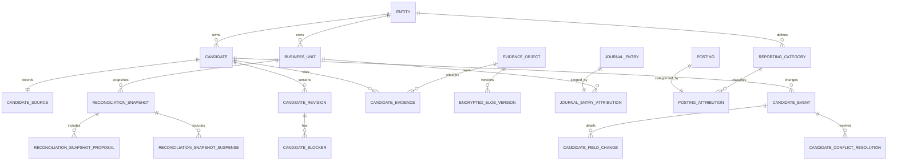

# R1 database schema and grants design

Status: design only; no migration, production role, database read, or real-data
enablement is authorized by this document.

## Purpose

This design defines the first PostgreSQL-backed Core read model that can replace
the packaged R1 fixture after separate implementation and operational gates. It
preserves the R0/R1 wire contract while making Candidate history, evidence
lineage, reconciliation snapshots, and POSTED ledger summaries database facts.

The design follows these existing invariants:

- Core remains the only owner of real financial facts. Web and other callers use
  the mTLS internal API and never connect to PostgreSQL.
- The migration owner is absent from API, worker, and reader runtimes.
- Runtime roles have no owner membership, `SET ROLE`, `TEMPORARY`, schema
  creation, trigger control, or direct `audit_event` insert capability.
- Audit writes use allowlisted `SECURITY DEFINER` functions with
  `search_path=pg_catalog` and schema-qualified object names.
- Candidate and reconciliation state is append-only or forward-only; POSTED
  ledger facts remain immutable.
- S1 key material remains outside PostgreSQL. The database stores encrypted
  envelope metadata, not KEKs or plaintext DEKs.

## Confirmed decisions

1. Candidate truth is a complete immutable revision history plus typed domain
   events; a mutable current row is not the sole fact.
2. R1 uses a new `ledgerbridge_reader` login. It does not reuse
   `ledgerbridge_api` and receives no business-table write grants.
3. Ledger summaries aggregate live POSTED facts. Reconciliation uses immutable
   snapshots.
4. A `business_unit` has a UUID identity and stable entity-scoped `ref`.
5. Evidence owns an immutable entity and business unit. A Candidate with an
   assigned business unit may reference only evidence in that exact scope.
6. A Candidate whose business unit is still null may reference evidence from
   the same entity. This does not grant evidence download: download authorization
   still uses the evidence object's own business unit.
7. Encrypted blob rotations append a new version referencing its predecessor;
   old versions are not overwritten.
8. Reporting categories are independent, entity-scoped dimensions. They are
   not account identifiers or Candidate categories.
9. The existing R0 fixture remains an API projection golden. It is not imported
   as a complete database aggregate.
10. A reconciliation proposal amount is the signed primary-leg amount, never
    the zero-sum total of all legs.
11. Initial R1 migrations grant zero Candidate, snapshot, evidence, or ledger
    attribution business writes to runtime roles.
12. Evidence download audit persists through one allowlisted
    `SECURITY DEFINER` wrapper over the existing append-only audit chain.
13. Candidate source identity stores an immutable opaque provider reference and
    an optional `source_record` foreign key.
14. HTTP principal entity/business-unit scope remains enforced by the typed
    mTLS application boundary. PostgreSQL limits the reader to allowlisted
    columns and no writes; it does not pretend a shared connection can verify an
    HTTP principal through a caller-controlled session setting.
15. Accounting month is an explicit immutable business attribution, not a
    value derived from `occurred_at`.
16. Candidate revisions snapshot business-unit and category labels so later
    dimension renames cannot rewrite historical projections.
17. Reconciliation revision is local to `(entity, business_unit, month)` and
    also records a global ledger/audit watermark.
18. Every typed Candidate, blob, and snapshot event binds one-to-one to an
    append-only `audit_event`.
19. Production Candidate pagination uses a signed keyset cursor bound to the
    principal, grants, normalized filters, policy generation, and snapshot
    horizon. Missing cursor key custody fails closed.
20. Existing ledger facts gain one-to-one immutable attribution tables rather
    than new mutable columns on the audited core rows.
21. Implementation is split across three forward migrations: Candidate/evidence,
    ledger/reconciliation attribution, then reader views/functions/grants.

## Trust and data flow

```text
mTLS caller
   |
   | typed, current principal + policy generation
   v
Core internal-read service
   |-- application entity/business-unit authorization
   |-- signed cursor verification
   |-- SELECT allowlisted projection views as ledgerbridge_reader
   |-- evidence ciphertext read through the encrypted ArtifactStore boundary
   `-- EXECUTE append_internal_evidence_read_audit(...)
                |
                `-- existing append-only audit_event chain
```

The reader credential authenticates Core, not the upstream HTTP caller. A SQL
injection in the read service could therefore read other rows exposed by a view,
although it still could not mutate business tables. RLS based on an arbitrary
custom GUC would not close that gap because the same connection could set the
GUC. Per-caller database roles or cryptographically verifiable database claims
would be a separate security design.

## Logical relationship model



Base facts stay in `public`; the owner exposes only closed views and one audit
function in a dedicated `internal_read` schema.

## Migration A: Candidate and evidence facts

Proposed revision: `20260824_0012_r1_candidate_evidence`.

### `public.business_unit`

- `id uuid primary key default gen_random_uuid()`
- `entity_id uuid not null references public.entity(id) on delete restrict`
- `ref varchar(100) not null`
- `label varchar(200) not null`
- `created_at timestamptz not null default current_timestamp`
- `retired_at timestamptz null`
- unique `(entity_id, ref)`
- checks require trimmed nonempty `ref`/`label` and `retired_at >= created_at`

`id`, `entity_id`, `ref`, and `created_at` are immutable. A future decision
command may rename the current label or retire a unit, but historical Candidate
revisions retain their label snapshots. Delete is denied while any fact refers
to the row.

### `public.reporting_category`

- `id uuid primary key default gen_random_uuid()`
- `entity_id uuid not null references public.entity(id) on delete restrict`
- `code varchar(100) not null`
- `label varchar(200) not null`
- `created_at timestamptz not null default current_timestamp`
- `retired_at timestamptz null`
- unique `(entity_id, code)`

Identity fields are immutable. Category codes are independent from
`account.identifier` and Candidate category codes.

### `public.candidate`

- `id uuid primary key`
- `short_id varchar(32) not null unique`
- `entity_id uuid not null references public.entity(id) on delete restrict`
- `contract_version varchar(64) not null`
- `created_at timestamptz not null`
- `supersedes_candidate_id uuid null references public.candidate(id) on delete restrict`
- partial unique `supersedes_candidate_id where not null`

All columns are immutable. `superseded_by_candidate_ref` is derived from the
unique reverse edge instead of stored twice. A successor must have the same
entity and is created in the same future decision transaction that moves the old
Candidate from `CONFIRMED` to `SUPERSEDED`.

### `public.candidate_source`

- `candidate_id uuid primary key references public.candidate(id)`
- `ingest_channel_id varchar(64) not null references public.ingest_channel(id)`
- `source_system_id varchar(64) not null references public.source_system(id)`
- `source_event_ref uuid not null`
- `source_record_id uuid null references public.source_record(id) on delete restrict`
- `display_label varchar(200) not null`
- unique `(source_system_id, source_event_ref)`

The row is immutable. `source_event_ref` remains available when a provider has
no `source_record`; the optional foreign key gives traceability after a real
import. Existing registry IDs stay lower-case and bounded to 64 characters;
wire labels are snapshots, not registry keys.

### `public.candidate_revision`

- primary key `(candidate_id, revision)`
- `candidate_id uuid references public.candidate(id) on delete restrict`
- `revision integer check (revision >= 1)`
- `status varchar(16)` with the frozen Candidate status CHECK
- `business_unit_id uuid null references public.business_unit(id)`
- `business_unit_ref_snapshot varchar(100) null`
- `business_unit_label_snapshot varchar(200) null`
- `category_id uuid null references public.reporting_category(id)`
- `category_code_snapshot varchar(100) null`
- `category_label_snapshot varchar(200) null`
- `amount_minor bigint null`
- `currency varchar(3) null check (currency is null or currency = 'CNY')`
- `accounting_month date null check (date_trunc('month', accounting_month) = accounting_month)`
- `summary varchar(500) not null`
- `confidence_basis_points smallint not null check (confidence_basis_points between 0 and 10000)`
- `created_at timestamptz not null`
- `updated_at timestamptz not null check (updated_at >= created_at)`

The business-unit UUID/ref/label fields are all null or all non-null. Category
fields follow the same rule. A trigger checks that referenced dimensions share
the Candidate entity and that snapshot refs match their immutable dimension
refs. `PENDING`, `CONFIRMED`, and `SUPERSEDED` require business unit, category,
amount, currency, and accounting month; `INCOMPLETE`, `CONFLICTED`, and
`IGNORED` may retain missing fields according to their blockers.

Rows are append-only. Revision 1 is required before any higher revision, each
new revision is exactly previous + 1, and event/revision creation occurs in one
future command function transaction.

### `public.candidate_blocker`

- primary key `(candidate_id, revision, ordinal)`
- composite foreign key to `candidate_revision`
- `code varchar(64) not null`
- `message varchar(500) not null`
- `field varchar(64) null`
- `conflict_ref uuid null`
- `evidence_ref uuid null references public.evidence_object(evidence_ref)`

The table is append-only and uses typed columns rather than JSONB as its only
fact source.

### `public.candidate_event`

- `event_ref uuid primary key`
- `candidate_id uuid not null references public.candidate(id)`
- `operation_id uuid not null unique`
- `command_fingerprint bytea not null check (octet_length(command_fingerprint) = 32)`
- `event_type varchar(40)` with a fixed CHECK including creation and every frozen action
- `action varchar(32) null` with the frozen Candidate action CHECK
- `from_revision integer null`
- `to_revision integer not null`
- `from_status varchar(16) null`
- `to_status varchar(16) not null`
- `actor_ref varchar(200) not null`
- `reason varchar(1000) not null`
- `derived_candidate_id uuid null references public.candidate(id)`
- `occurred_at timestamptz not null`
- `audit_event_id uuid not null unique references public.audit_event(id)`

Creation has no from revision/status and targets revision 1. Every transition
references consecutive revisions and a frozen legal state edge. Terminal states
cannot reopen. `SUPERSEDE` requires exactly one same-entity derived Candidate at
revision 1. The `operation_id` plus command fingerprint defines idempotent replay.

`candidate_field_change(event_ref, field, previous_value, new_value)` and
`candidate_conflict_resolution(event_ref, conflict_ref, resolution)` are typed,
append-only child tables with field/action shape CHECKs. The values may use
bounded JSON scalars for nullable typed diffs, but not arbitrary business payloads.

### `public.evidence_object`

- `evidence_ref uuid primary key`
- `entity_id uuid not null references public.entity(id)`
- `business_unit_id uuid not null references public.business_unit(id)`
- `plaintext_sha256 bytea not null check (octet_length(plaintext_sha256) = 32)`
- `plaintext_size bigint not null check (plaintext_size >= 0)`
- `declared_media_type varchar(200) not null`
- `received_at timestamptz not null`
- `raw_artifact_id uuid null references public.raw_artifact(id) on delete restrict`
- `source_record_id uuid null references public.source_record(id) on delete restrict`
- unique `(evidence_ref, entity_id, business_unit_id)` to support composite scope FKs

The row is immutable. Storage keys, envelope headers, and wrapped-key metadata
are not exposed by internal-read views.

### `public.encrypted_blob_version`

- `blob_ref uuid primary key`
- `evidence_ref uuid not null references public.evidence_object(evidence_ref)`
- `predecessor_blob_ref uuid null unique references public.encrypted_blob_version(blob_ref)`
- `object_ref uuid not null`
- `ciphertext_sha256 bytea not null unique check (octet_length(ciphertext_sha256) = 32)`
- `ciphertext_size bigint not null check (ciphertext_size >= 0)`
- `storage_key varchar(500) not null unique`
- `envelope_schema varchar(64) not null`
- `algorithm varchar(64) not null`
- `chunk_size integer not null check (chunk_size > 0)`
- `stream_header bytea not null`
- `wrapped_key_generation bigint not null check (wrapped_key_generation >= 1)`
- `wrapped_key_nonce bytea not null`
- `wrapped_key_ciphertext bytea not null`
- `created_at timestamptz not null`
- `audit_event_id uuid not null unique references public.audit_event(id)`

Rows are append-only. A trigger requires the predecessor to belong to the same
evidence and prevents branches. The active version is the row for which no later
row names it as predecessor. KEKs and plaintext DEKs never enter this table.

### `public.candidate_evidence`

- primary key `(candidate_id, ordinal)`
- unique `(candidate_id, evidence_ref)`
- `candidate_id uuid references public.candidate(id)`
- `evidence_ref uuid references public.evidence_object(evidence_ref)`
- `kind varchar(64) not null`
- `media_type_snapshot varchar(200) not null`
- `display_name_snapshot varchar(200) not null`
- `download_available boolean not null`

`kind`, media type, and display name belong to the Candidate association, because
the same physical evidence can have different projection labels. The link is
append-only. A trigger enforces the same entity. If the current Candidate
revision has a business unit, the evidence unit must match it. If the Candidate
is unassigned, the link may exist but does not confer evidence-download scope.

## Migration B: ledger attribution and reconciliation snapshots

Proposed revision: `20260824_0013_r1_ledger_reconciliation`.

### `public.journal_entry_attribution`

- `entry_id uuid primary key references public.journal_entry(id) on delete cascade`
- `business_unit_id uuid not null references public.business_unit(id)`
- `accounting_month date not null` constrained to the first day of a month
- `created_at timestamptz not null default current_timestamp`

The attribution is immutable and its business unit must belong to the same
entity as the journal entry. The existing POSTED completeness trigger is extended
to require exactly one attribution row. Attribution insert/update/delete is
blocked once the journal entry is POSTED.

### `public.posting_attribution`

- `posting_id uuid primary key references public.posting(id) on delete cascade`
- `reporting_category_id uuid not null references public.reporting_category(id)`
- `category_code_snapshot varchar(100) not null`
- `category_label_snapshot varchar(200) not null`
- `created_at timestamptz not null default current_timestamp`

The category must share the journal entry entity. The existing POSTED
completeness trigger requires exactly one attribution for every posting.
Attribution becomes immutable with the posting. Ledger summary groups the stored
category-code snapshot so later dimension label changes do not rewrite history.

### `public.reconciliation_snapshot`

- `snapshot_ref uuid primary key`
- `entity_id uuid not null references public.entity(id)`
- `business_unit_id uuid not null references public.business_unit(id)`
- `accounting_month date not null`
- `snapshot_revision integer not null check (snapshot_revision >= 1)`
- `ledger_audit_sequence bigint not null`
- `ledger_audit_hash bytea not null check (octet_length(ledger_audit_hash) = 32)`
- `posted_amount_minor bigint not null`
- `currency varchar(3) not null check (currency = 'CNY')`
- `created_at timestamptz not null`
- `audit_event_id uuid not null unique references public.audit_event(id)`
- unique `(entity_id, business_unit_id, accounting_month, snapshot_revision)`

Snapshots are append-only. Revision must be the previous local revision + 1.
The watermark identifies the exact append-only audit horizon used to build the
snapshot.

Child tables are also append-only:

- `reconciliation_snapshot_blocker(snapshot_ref, ordinal, code, message, field,
  conflict_ref, evidence_ref)`
- `reconciliation_snapshot_proposal(snapshot_ref, proposal_ref,
  reconciliation_group_id null, relation, status, amount_minor,
  amount_basis='PRIMARY_LEG', currency='CNY')`
- `reconciliation_snapshot_suspense(snapshot_ref, suspense_ref,
  suspense_item_id null, status, reason, amount_minor, currency='CNY')`

The optional foreign keys connect complete production facts; golden projections
may use opaque refs. A proposal never derives `amount_minor` from the zero-sum
sum of all reconciliation legs.

## Migration C: reader role, views, audit wrapper, and grants

Proposed revision: `20260824_0014_r1_internal_read_surface`.

### Cluster role bootstrap

The deployment bootstrap creates `ledgerbridge_reader` with:

```sql
LOGIN NOSUPERUSER NOCREATEDB NOCREATEROLE NOINHERIT NOREPLICATION NOBYPASSRLS
```

Its password differs from owner/API/worker/compatibility credentials. The
migration fails closed if the role is absent, privileged, owns the database or
schema, equals the migration user, or has any membership. Production containers
receive only their matching URL; no process receives both reader and owner URLs.

### `internal_read` projection schema

The migration owner creates the schema, revokes all from `PUBLIC`, and does not
grant reader `USAGE` or table access in `public`. Closed owner-executed views use
fully qualified names and `security_barrier=true`:

- `internal_read.candidate_current_v`
- `internal_read.candidate_evidence_v`
- `internal_read.evidence_metadata_v`
- `internal_read.reconciliation_current_v`
- `internal_read.reconciliation_blocker_v`
- `internal_read.reconciliation_proposal_v`
- `internal_read.reconciliation_suspense_v`
- `internal_read.ledger_posted_total_v`

The views expose only wire-contract fields and stable identifiers. They never
expose raw source fields, Review payloads, storage keys, envelope metadata,
wrapped keys, filesystem paths, database identities, or audit payload internals.

`candidate_current_v` selects the highest complete revision per Candidate and
supports keyset ordering on `(created_at, candidate_id)`. Reconciliation current
selects the highest local snapshot revision. Ledger totals join only POSTED
journal entries with complete immutable attribution and group by entity,
business unit, accounting month, currency, and category-code snapshot.

The application must put entity/business-unit predicates in the SQL query before
materialization. Views do not grant HTTP scope by themselves.

### Evidence-read audit wrapper

`internal_read.append_internal_evidence_read_audit(...) returns uuid` is
`SECURITY DEFINER`, owned by the migration owner, with
`SET search_path = pg_catalog`. It accepts only:

- principal ref and verified SAN;
- policy generation;
- evidence/entity/business-unit refs;
- verified byte size and plaintext SHA-256.

The function verifies bounded formats, reloads immutable evidence scope/digest/
size from fully-qualified base tables, rejects any mismatch, and calls the
existing fully-qualified append-only audit function with a fixed action and
target type. It returns the new audit event ID. The reader cannot choose another
event type or write the audit table directly.

The function records what Core asserted after mTLS verification; PostgreSQL does
not independently authenticate the HTTP SAN. This trust boundary is explicit.

### Exact grant matrix after migration C

| Object | owner | ledgerbridge_reader | ledgerbridge_api | ledgerbridge_worker |
|---|---|---|---|---|
| New base tables | ALL | none | none | none |
| `internal_read` schema | ALL | USAGE | none | none |
| Internal read views | ALL | SELECT | none | none |
| Evidence audit wrapper | ALL | EXECUTE | none | none |
| Audit/base sequences | owner only | none | unchanged | unchanged |
| Candidate/blob/snapshot writes | owner only | none | none | none |

Every new table, view, sequence, and function is first `REVOKE ALL ... FROM
PUBLIC`. Migration C reasserts the exact matrix rather than relying on default
privileges. `ledgerbridge_app` receives nothing and stays `NOLOGIN` in production.

Future I1/D1 migrations may grant narrowly shaped command functions to worker or
API after their own design, tests, security review, and authorization. They must
not grant direct broad DML merely because the tables exist.

## Query and index plan

- Candidate current keyset: `(entity_id, business_unit_id, created_at, id)` and
  `(entity_id, business_unit_id, accounting_month, status, created_at, id)` on a
  maintained current pointer or equivalent latest-revision lookup.
- Candidate revision: `(candidate_id, revision desc)`.
- Candidate evidence: `(evidence_ref, candidate_id)`.
- Evidence metadata: `(entity_id, business_unit_id, evidence_ref)`.
- Reconciliation current: `(entity_id, business_unit_id, accounting_month,
  snapshot_revision desc)`.
- Journal attribution: `(business_unit_id, accounting_month, entry_id)`.
- POSTED ledger scan: partial index on `journal_entry(entity_id, id) where
  status='POSTED'`, then attribution and posting indexes by their primary/foreign
  keys.
- Reporting totals: `(reporting_category_id, posting_id)`.

The production cursor payload contains contract version, normalized filters,
principal ref, normalized entity/business-unit grants including explicit
unassigned permission, policy generation, snapshot/audit horizon, last
`created_at`, and last Candidate UUID. It is authenticated, not merely encoded.
Cursor signing/verification keys follow the credential store and rotation rules
outside the project workspace.

## Database invariants and failure behavior

- Dimension, Candidate identity, revisions, events, evidence, blob versions,
  links, attributions, and snapshots cannot be deleted by runtime roles.
- Append-only tables have database triggers that reject UPDATE/DELETE even if a
  future grant drifts.
- Every security function is schema-qualified and has a fixed safe search path.
- All cross-entity and assigned-candidate cross-business-unit links fail in the
  database.
- Unassigned Candidate visibility never implies evidence visibility.
- Event/revision gaps, illegal state edges, reused operation IDs with different
  fingerprints, and audit/event mismatches fail in the database.
- POSTED entries without complete business-month/category attribution fail to
  post; POSTED attribution cannot later change.
- Snapshot revision gaps and duplicate local revisions fail.
- Missing reader role, drifted membership, excess grants, missing audit backend,
  missing cursor key, or missing production mTLS verifier keeps the real R1
  feature disabled.

## Migration and validation plan

Each migration is forward-only in production. Downgrade exists only for empty,
isolated development databases and refuses destructive downgrade when any new
table contains data or a later audit binding depends on it.

For every migration:

1. upgrade from the current `0011` head on a fresh PostgreSQL 15 instance;
2. inspect constraints, triggers, security-function ownership/search path, and
   exact grants through `pg_catalog`;
3. exercise invalid cross-scope, revision-gap, illegal-transition, audit-forgery,
   POSTED-attribution, blob-branch, and snapshot-gap attacks;
4. prove API/worker/reader cannot use TEMP, create schema objects, `SET ROLE`,
   alter triggers, truncate, or directly write audit/business facts;
5. prove the reader can select only closed views and execute only the evidence
   audit wrapper;
6. run empty upgrade/downgrade/upgrade and nonempty destructive-downgrade denial;
7. extend backup/restore validation to all three runtime roles, new objects,
   exact grants, functions, triggers, row counts, and encrypted metadata;
8. restore into a fresh checksummed PostgreSQL volume before any production
   migration authorization;
9. compare DB projections against the R0 golden and a separate complete database
   fact fixture; never seed the incomplete R0 projection as history;
10. run independent Sol security review at each migration boundary and again on
    the combined read service.

## Operational gates not satisfied by this design

- No migration files, ORM models, database roles, passwords, or grants have been
  created.
- No production mTLS verifier, certificate mapping, or policy rotation exists.
- No production reader deployment or durable database audit sink is installed.
- No production KeyProvider, LUKS/dm-crypt storage proof, monotonic state anchor,
  encrypted backup-format adaptation, or fresh-host restore rehearsal exists.
- No I1 Candidate/evidence writer or D1 decision command function is authorized.
- No real Hermes, Outlook, OneDrive, legacy workbook, Connector, OAuth, evidence,
  Candidate, or report data is enabled.

Until all applicable gates pass, `LEDGERBRIDGE_ENABLE_INTERNAL_READ_API=true`
continues to be rejected in production and real ingest remains unconditionally
disabled.
