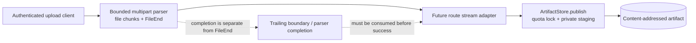
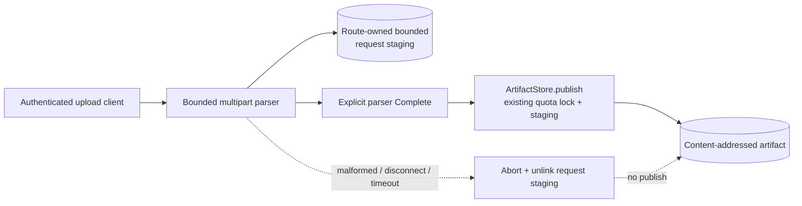
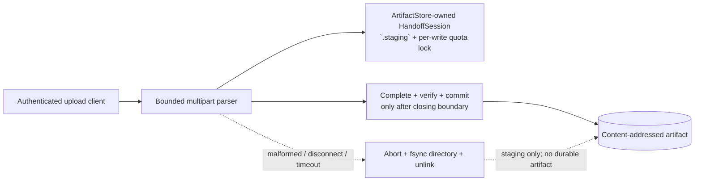
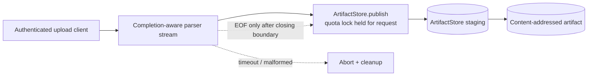

# Security Hardening Proposal: make multipart completion and artifact publication one explicit boundary

## Decision

We need a publication boundary that is later than `MultipartFileEnd` and no
earlier than parser completion. The current source snapshot contains no HTTP
route, so this proposal is a design gate for the future internal/test-only
route. It does not claim that a vulnerability is deployed or that any option is
implemented.

## Executive Recommendation

There are three materially different choices:

1. **Bounded request spool, then existing publish** — the route writes file
   bytes to a private bounded file, waits for an explicit parser `Complete`,
   then calls the existing `ArtifactStore.publish` API.
2. **ArtifactStore-owned transactional handoff session** — the store owns the
   staged inode and quota accounting, and exposes typed `write`, `complete`,
   and `abort` transitions. Publication can adopt the sealed inode only after
   parser completion.
3. **Completion-aware stream over existing publish** — a wrapper feeds the
   parser into the current `publish` method but withholds EOF until completion;
   the existing quota lock remains held for the whole request.

I recommend Option 2 under the current 512 MiB staging, 50 MiB file, and
internal-only constraints. Option 1 is the safer schedule-driven bridge if we
are willing to build a second staging quota and cleanup surface. Option 3 is
appropriate only for a measured short experiment where the availability cost
of holding the global quota lock is explicitly accepted.

## Evidence

I inspected the source and tests at revision
`862056816126428c1694985da7b7b3272bc749bc`. The evidence collection digest is
`443933d9019784b0927617d985c3b1348bc9ae86f8b32e92ee95c67e246f490b`.

| Evidence | Finding or document | What it establishes |
| --- | --- | --- |
| H001 | [`ArtifactStore`](../../../../src/ledgerbridge/artifacts.py) | `publish()` holds the quota lock while reading a stream, writes private staging, and commits after stream EOF; exceptions clean the temporary path. |
| H002 | [`bounded multipart parser`](../../../../src/ledgerbridge/upload.py) | `MultipartFileEnd` is emitted when the file delimiter is found, while final-boundary validation and successful return happen later. |
| H003 | [`ArtifactStore tests`](../../../../tests/test_artifacts.py) | Existing tests cover stream failure cleanup, quota races, deduplication, and staging residue, but not route-level trailing-boundary publication. |
| H004 | [`multipart tests`](../../../../tests/test_upload.py) | Parser fragmentation, malformed headers, limits, invalid text and closing-boundary behavior are tested independently of storage. |
| H005 | [`approved Slice C design`](../../../../docs/tasks/2026-08-23-phase-3-slice-c-upload-endpoint-design.md) | The future route must use a bounded temporary handoff or equivalent two-phase staging before `ArtifactStore.publish`; no route is enabled. |

The key observed facts are H001 and H002. The structural inference is that a
future adapter can accidentally collapse two distinct states—file-byte
completion and request completion—into one EOF. That inference is not a report
of a current production exploit: H005 records that the route does not yet
exist. It is a design hazard we can remove before adding the route.

## Current Design And Failure Mode

The existing store is intentionally conservative. `ArtifactStore.publish`
creates a private `.staging` file, holds the cross-process quota lock, reads
until the supplied stream returns no bytes, fsyncs the file, verifies the
digest/size and then hard-links into the content-addressed tree. Its `finally`
block removes the temporary path when a read or verification error occurs.
Those are valuable controls and should remain the authority.

The multipart parser has a different state machine. It yields a
`MultipartFileStart`, then zero or more `MultipartFileChunk` events, and a
`MultipartFileEnd` once it sees the `\r\n--boundary` delimiter. It then checks
the two-byte boundary suffix, enters `final`, rejects trailing bytes, and only
returns normally after the closing boundary has been consumed. This separation
is correct for streaming, but it means `FileEnd` cannot safely mean “the
request is valid”.

The future route must therefore avoid an adapter like `read() -> b""` as soon
as `MultipartFileEnd` appears. In that shape, `publish()` can finish its
verification and create a durable path, after which the parser can discover a
bad suffix. The route would then have a published artifact with no successful
request outcome. The risk is inferred from H001/H002; it is precisely why H005
requires a two-phase handoff.

The most important edge is the dotted one: parser completion is not part of the
file event itself. We should make that edge explicit in the API rather than
leave it as an informal integration rule.

## Desired Invariants

We should be able to falsify the design with these invariants:

- Publication cannot commit until the parser has consumed and validated the
  closing boundary.
- Each accepted byte is charged once to the configured staging and published
  quotas; concurrent uploads cannot oversubscribe either limit.
- Malformed, cancelled, disconnected, over-limit, or failed uploads clean only
  their own private state and never overwrite or remove another artifact.
- A crash leaves either a valid content-addressed artifact or bounded,
  recoverable staging residue; no import row is created before the artifact
  commit and provenance checks succeed.
- The future route cannot bypass the store's digest, path, permission, fsync,
  deduplication or quota controls.

## Constraints And Non-Goals

The first route is synchronous and internal/test-only. We preserve the current
50 MiB per-file, 512 MiB aggregate staging and 10 GiB published limits from
D-011. We do not add authentication, an Idempotency-Key policy, a Connector,
database rows, production deployment, or a public endpoint here. No benchmark
numbers are available yet; performance and lock contention claims below are
source-derived expectations and require measurement.

## Before Architecture

The before view is intentionally the same abstraction level as all three
options: client, parser, route adapter, store and durable destination. The
store has strong local cleanup, but the route-to-store completion contract is
implicit. See [`artifact-handoff-before.mmd`](../diagrams/artifact-handoff-before.mmd).

## Options

### Option 1: bounded request spool, then existing publish

This option keeps the current store API intact. The route writes only file
chunks to a named, private request-staging file. The parser emits a new
explicit `Complete` signal only after final-boundary validation; only then does
the route rewind a sealed, read-only spool and call `ArtifactStore.publish`.
Any parser error, disconnect or timeout unlinks the request spool and never
invokes publication.

The attractive part is the narrow compatibility surface. Existing importer
callers and store tests remain unchanged, and the route can be rolled back by
turning off one feature flag. The cost is that we now have two staging owners:
the request spool and the store's own `.staging` file. If both are allowed to
use the same 512 MiB budget without a shared lock, two concurrent writers can
each believe capacity is available. If they use separate budgets, the host can
consume more disk than D-011 intends. We would also read the file a second time
and hash it again.

The spool must be immutable after `Complete`; a descriptor-backed reader or a
sealed temporary file is preferable to a path that can be replaced. A TTL
reaper must unlink only files with the route's private prefix, verify regular
file ownership, and fsync the containing directory. We should not let cleanup
scan or delete ArtifactStore's published tree.

The diagram's important delta is the new `Complete -> publish` edge. It closes
the early-EOF path, but it also introduces an independent disk and cleanup
surface before the existing store staging. See
[`artifact-handoff-bounded-request-spool-after.mmd`](../diagrams/artifact-handoff-bounded-request-spool-after.mmd).

| Change | Before | After | Security consequence | Cost |
| --- | --- | --- | --- | --- |
| Completion gate | Implicit stream EOF | Explicit parser `Complete` before publish | Trailing-boundary errors abort before durable publication | New parser/route protocol |
| Temporary bytes | Store-owned staging only | Request spool plus store staging | Parser failures have a private abort point | Potential double disk usage |
| Quota owner | ArtifactStore lock | Route budget plus store lock | Safe only if aggregate accounting is shared | More metrics and race cases |
| Failure cleanup | Store `finally` | Route abort, then store cleanup | No-row/no-blob path is testable at both phases | TTL reaper and crash tests |

### Option 2: ArtifactStore-owned transactional handoff session

Here we make the publication boundary a first-class store-owned state machine.
`ArtifactStore.begin_handoff()` creates one private `.staging` inode and a
bounded session. `write(chunk)` obtains the existing quota lock for the
admission check and write, so other processes see the current staged size.
`complete()` is callable only after the route has consumed parser `Complete`;
it fsyncs and verifies the descriptor, checks the published quota, and adopts
or hard-links that sealed inode into the content-addressed destination under
the same publication authority. `abort()` closes the descriptor, removes the
private inode and fsyncs the staging directory. A stale-session reaper uses
the same ownership and identity checks as current stale staging cleanup.

This design makes the safe path easier to use correctly: the route receives a
typed session, not a generic stream whose EOF semantics it must invent. It also
keeps one aggregate staging budget and avoids a second request-spool read. The
tradeoff is centrality. We would be changing the storage choke point and must
preserve the old `publish()` behavior, likely by implementing it on top of the
same primitives or leaving it as a compatibility path during rollout. The
session state machine should reject writes after `complete` or `abort`, reject
double completion, and never accept a caller-provided destination path.

Per-write locking means a slow client no longer holds the global lock between
chunks, but it can still occupy bounded staging until its deadline. We should
record active bytes and session age, not raw filenames or body content. The
published quota check must happen at commit, because another process may have
published bytes while this session was receiving data.

The security-relevant change is that `Complete` is a store transition, not a
comment in the route. The same component owns byte accounting, descriptor
identity, digest verification, destination derivation and publication. See
[`artifact-handoff-transactional-session-after.mmd`](../diagrams/artifact-handoff-transactional-session-after.mmd).

| Change | Before | After | Security consequence | Cost |
| --- | --- | --- | --- | --- |
| Lifecycle | Generic `read()` and EOF | Typed `write`/`complete`/`abort` session | Invalid early publication becomes a rejected state transition | New API and state tests |
| Staging | One publish temp per call | One handoff inode adopted at commit | No second request spool and one quota authority | More store internals |
| Quota | Lock held for whole stream | Lock around bounded admission/write and commit | Better concurrency without uncharged bytes | Lock protocol and crash reasoning |
| Recovery | Stale publish temps | Stale session identities and explicit states | Reaper can distinguish private incomplete work | New metrics/reaper cases |

### Option 3: completion-aware stream over existing publish

This is the smallest implementation. We add an explicit parser `Complete`
event and a stream wrapper that blocks EOF until it has seen that event. The
existing `ArtifactStore.publish` then continues to do all staging, quota,
verification and publication. Any parser failure is surfaced as a stream read
error, so the store's existing `finally` cleanup runs.

The strongest case for this option is compatibility: no second spool and no
new store lifecycle. It also gives us a quick internal proof that the early-EOF
hazard is real and that the parser can be adapted without changing durable
storage. What gives me pause is availability. The store currently holds the
cross-process quota lock around the entire `stream.read` loop. A client that
delivers one small chunk per deadline interval can block unrelated publishers
until timeout. A future caller can also bypass the wrapper and accidentally
recreate the same problem.

The new edge is correct but the old lock scope remains. See
[`artifact-handoff-lock-held-stream-after.mmd`](../diagrams/artifact-handoff-lock-held-stream-after.mmd).

| Change | Before | After | Security consequence | Cost |
| --- | --- | --- | --- | --- |
| EOF semantics | File-end could be mistaken for EOF | EOF withheld until parser `Complete` | Closes the early publication path if every caller uses the wrapper | Protocol discipline |
| Staging | Existing store staging | Unchanged | Keeps one durable authority | No reduced lock duration |
| Lock scope | Whole stream | Whole stream | Slow clients can consume publication capacity | Availability risk |
| Failure | Store catches stream errors | Parser errors become stream errors | Existing cleanup remains effective | Error mapping must stay bounded |

## Comparison

| Dimension | Option 1: request spool | Option 2: transactional session | Option 3: lock-held stream |
| --- | --- | --- | --- |
| Security | Improves; explicit completion and private abort | Improves most; completion and commit are one store state machine | Improves if wrapper is universal |
| Performance | Likely regresses from second write/read/hash | Likely best after implementation; one staged inode | Best I/O path, but lock held throughout |
| Memory | Bounded file-backed | Bounded file-backed | Bounded streaming |
| Reliability | Simple abort, but second crash/reaper surface | Explicit abort/complete and one quota owner; larger test surface | Simple cleanup, weaker slow-client isolation |
| Operability | Two staging metrics/quotas | One store namespace plus session metrics | Lock-wait/request-age monitoring |
| Migration | Lowest source compatibility risk | Highest central API change; retain publish compatibility | Low source change, high caller-discipline risk |
| Reversibility | Feature-flag route and remove adapter | Feature-flag session route while preserving old publish | Remove wrapper and route flag |

The decision turns on two uncertainties rather than a made-up score. First, we
need to measure whether request staging can share the 512 MiB budget without
creating unacceptable disk pressure; that determines whether Option 1 is a
credible bridge. Second, we need lock-wait measurements for slow internal
clients; if they remain below an agreed threshold, Option 3 may be an efficient
temporary experiment. Neither result is available in the current evidence.

## Recommendation

I recommend Option 2. It gives the route one safe vocabulary—write, complete,
abort—and keeps the most security-sensitive accounting in the component that
already owns digest, path, permission, fsync, deduplication and publication.
We can preserve the fast path by adopting the sealed staged inode rather than
copying it again, while per-write locking avoids holding the quota lock across
network pauses.

Option 1 should win if the project needs a route quickly and we can first prove
one aggregate quota and robust stale-spool cleanup. Option 3 should win only
for a deliberately bounded internal experiment where slow-client lock
contention is measured and accepted. A public or multi-client route would make
me uncomfortable with either Option 1's split quota ownership or Option 3's
lock scope.

## Evidence Coverage And Residual Risk

| Evidence | Option 1 | Option 2 | Option 3 | Residual risk |
| --- | --- | --- | --- | --- |
| H001 — ArtifactStore stream publication | addresses; keep existing store checks | addresses; centralizes new commit state in store | addresses; keep existing store checks | Any compatibility wrapper must not bypass digest/path/quota verification. |
| H002 — parser FileEnd versus final state | addresses; spool waits for `Complete` | addresses; `complete()` is a typed store transition | addresses; wrapper withholds EOF | A future caller can still misuse raw events unless the safe API is the only route input. |
| H003 — existing cleanup/quota tests | addresses; add route spool tests | addresses; extend state and concurrency tests | addresses; add lock-contention tests | Current tests do not prove HTTP cancellation or crash behavior. |
| H004 — parser boundary/limit tests | addresses; preserve parser suite | addresses; add session adapter tests | addresses; add EOF gating tests | Parser correctness alone does not prove publication atomicity. |
| H005 — approved no-orphan requirement | addresses | addresses | mitigates | Route remains disabled until authentication, quota mapping and handoff tests are reviewed. |

All three options retain the tactical parser limits and ArtifactStore cleanup.
None by itself establishes database/import atomicity; the future route must
call `EvidenceImporter` only after artifact commit and use its existing bounded
state transitions. None authorizes production or real Connector registration.

## Migration And Rollout

The safe rollout is deliberately staged:

- Keep the current parser and `ArtifactStore.publish` paths unchanged while
  implementing the selected handoff behind an internal/test-only feature flag.
- Add a route adapter that accepts only the parser's validated channel,
  filename and media type; it must not accept actor, reason, Connector or
  `source_system` values from the client.
- Exercise malformed suffix, disconnect, timeout, size overflow, digest,
  quota, duplicate, symlink, stale-cleanup and crash cases before enabling any
  test endpoint.
- Run one controlled internal profile with bounded concurrency and collect
  active staging bytes, lock wait/age, abort reasons, cleanup failures and
  commit latency. Do not log raw body, filename, tokens or exception strings.
- Roll back by disabling the route flag. Published content and existing
  importer behavior remain untouched.

## Validation Plan

The selected design must pass these source-level and behavior-level checks:

- one byte below, exactly at, and one byte above the 50 MiB limit with chunks
  split at every boundary position;
- malformed trailing boundary after valid file bytes, including a disconnect
  between `FileEnd` and `Complete`, leaves no published destination and no
  staging residue after abort;
- concurrent uploads cannot exceed the 512 MiB staging or 10 GiB published
  limits, and identical bytes deduplicate without a second published charge;
- descriptor replacement, symlink insertion, digest mismatch, fsync failure,
  parser exception and process termination never overwrite another artifact;
- writes after `complete`/`abort`, double completion, missing completion and
  stale-session cleanup are deterministic bounded errors;
- route-level integration creates no `RawArtifact`, `ImportJob` or audit event
  before `ArtifactStore` returns a committed artifact;
- Linux and Windows CI cover their respective locking, descriptor and fsync
  primitives, while a disposable Hermes PostgreSQL replay checks the full
  route/import failure matrix before any production decision.

Performance validation must report workload, metric and threshold rather than
guessing. At minimum we should compare wall time, p95 latency, bytes written,
peak RSS, staging occupancy, lock wait and cleanup lag for 1 MiB, 50 MiB,
concurrent and slow-client cases. The option is not ready for route enablement
until those measurements are reviewed against the internal-only concurrency
budget.

## Implementation Work Packages

These are design handoff packages, not authorization to modify source:

1. Define the selected handoff state machine and error taxonomy, including the
   parser `Complete` contract.
2. Implement bounded writes, quota admission, descriptor sealing, digest
   verification, commit/adoption, abort and stale cleanup in the selected
   owner.
3. Add parser-to-handoff adapter tests that prove FileEnd is not EOF and that
   malformed trailing data cannot publish.
4. Add concurrency, crash, symlink, fsync, quota and platform-specific tests;
   preserve the existing `ArtifactStore.publish` suite.
5. Add observability and a feature flag, then perform internal-only replay and
   security-diff review before considering route implementation.

## Open Questions

- Does D-011's 512 MiB staging limit cover request-owned temporary files, or
  must the selected design make all staging ArtifactStore-owned?
- What maximum request age and concurrent internal upload count are acceptable
  for the first route?
- Which crash points must be replayed on both Windows and Linux before the
  handoff API is considered durable?
- Should parser completion be a public event, or should callers receive only a
  sealed handoff interface that makes premature EOF impossible?
