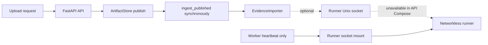
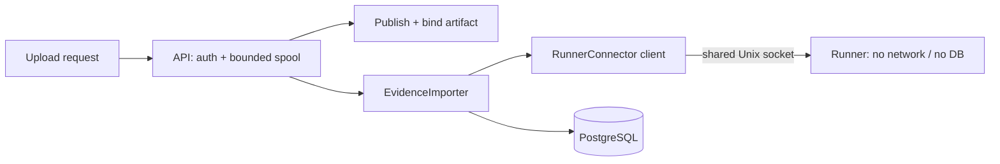
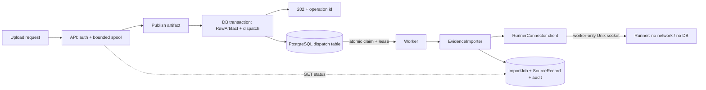

# Security Hardening Proposal: Connector execution composition

## Decision

For a production Connector selected by the signed manifest, use **Option 2 —
worker-owned asynchronous execution**. Keep the existing synchronous upload
contract only for internal/test profiles whose Connector set is static and
does not require the production runner. Do not mount `connector-socket` into
the API as a convenience for the production path.

This is a composition decision, not an implementation or deployment
authorization. The current route remains feature-flagged and production
forced-off. The worker path requires a durable dispatch contract, a status
read model and retry/lease controls before it can be implemented.

## Executive Recommendation

The existing API publishes an artifact and immediately calls
`EvidenceImporter.ingest_published()`. That importer performs detection and
parsing in the caller's process. The API does not mount the runner socket;
only the worker does. The runner is optional, network-disabled and
low-privilege. These facts make a synchronous production runner path either
unavailable or dependent on widening the API's filesystem authority.

Use two explicitly named runtime profiles:

1. **Internal/test synchronous profile:** preserve the current bounded response
   contract and use only reviewed static/test connectors. It must not imply
   production runner support.
2. **Production runner profile:** publish the artifact, commit a durable
   dispatch, return `202 Accepted` with an operation identifier, and let the
   worker claim and execute the import through its already-mounted socket.

The second profile keeps the runner socket out of the API, makes runner
availability independent of request lifetime, and gives retries and rollout a
durable owner. It costs a migration, an async status contract and queue
operations. Those costs are real and must not be hidden behind a background
thread or an untracked in-memory queue.

## Evidence

| Evidence | Finding or source | What it establishes |
| --- | --- | --- |
| `A04` | `src/ledgerbridge/imports.py` — `ingest_published()` and `_ingest_and_import()` | The current handoff continues synchronously through detection, parsing and publication. |
| `direct source check` | `src/ledgerbridge/models/evidence.py` — `ImportJobStatus` and `ImportJob` | The outcome state machine exists, but it is not a dispatch queue and has no claim lease or retry state. |
| `A05` | `src/ledgerbridge/connector_runner.py` — bounded supervisor | The runner is already a low-privilege execution boundary; composition must keep its socket and manifest authority explicit. |
| `A06` | `src/ledgerbridge/runner_client.py` — Unix socket client | Runner execution is a blocking client call with bounded protocol/deadline behavior. |
| `A07` | `src/ledgerbridge/worker.py` — heartbeat-only loop | Worker builds an importer but does not poll, claim or execute import work. |
| `A08` | `docker-compose.yml` — API/worker/runner mounts | Worker and runner share `connector-socket`; API does not. Runner has `network_mode: none` and no application secrets. |
| `A01` | `src/ledgerbridge/main.py` — upload route | The route currently returns a full `ImportOutcome`; changing it to `202` is an API-contract change. |
| `direct source check` | `src/ledgerbridge/artifacts.py` / `src/ledgerbridge/imports.py` — publication and artifact binding | Filesystem publication and database binding are separate steps and need an atomic dispatch handoff/reconciliation rule. |

## Current Design And Failure Mode

The current path is:

```text
HTTP request -> bounded multipart spool -> ArtifactStore handoff
             -> importer.ingest_published()
             -> detect -> RunnerConnector (only if caller supplied one)
             -> parse -> SourceRecord/ImportJob terminal state
```

The production composition is incomplete by construction: the API has no
runner socket and `get_internal_connectors()` returns an empty sequence. A
future caller that simply mounts the socket would create a new authority
without defining API backpressure, socket permissions, manifest loading,
timeouts or rollback. A future caller that starts a background thread would
lose work on process restart and could return success before a durable job
exists.

The existing `ImportJob` cannot safely be repurposed as the queue row without
mixing two identities. Its `(artifact, connector, version)` identity is only
known after detection, while an async request must be durable before detection
and may end in `NO_CONNECTOR` or `AMBIGUOUS_CONNECTOR`. Its database state
constraint also has no lease owner, attempt count or retry deadline.

## Desired Invariants

- The API never needs the runner socket in the production profile.
- A `202` response is issued only after the artifact and dispatch intent are
  durably recorded; a process crash after the response cannot erase the work.
- Dispatch claims are atomic, lease-bounded and idempotent. At most one worker
  owns a live claim, and a stale claim can be recovered without duplicating
  source records or audit terminal events.
- The worker loads the same verified manifest generation/digest as the runner,
  and refuses work on mismatch or an invalid/empty production registry.
- The request supplies an ingest channel only. Detection still chooses the
  server-owned Connector; the queue never accepts connector or source-system
  names from the request.
- Actor and reason are server-derived, bounded and persisted with the dispatch
  intent so the worker can produce the same audit meaning after a restart.
- `ImportJob` remains the Connector-specific outcome state machine. The new
  dispatch record tracks orchestration and is not presented as a successful
  import until the existing terminal audit binding is committed.
- Retries are bounded and classified. A runner protocol/availability failure
  may retry; a contract, provenance or identity conflict must terminalize
  without an unbounded loop.
- Artifact bytes are never deleted while a dispatch or import job can still
  reference them. Cleanup is a separate, observable reconciliation action.
- Status and diagnostics expose bounded IDs, states, attempts and stable error
  codes; they never expose tokens, manifest signatures, raw evidence or parser
  payloads.

## Constraints And Non-Goals

This proposal does not add a queue implementation, change the route, add a
status endpoint, mount a socket, register a real Connector or enable
production. It assumes the current runner remains networkless, read-only,
credential-free and resource-bounded. It does not select an authentication
provider, signing-key owner, source-system owner or external message broker.

The first implementation may use PostgreSQL as the durable dispatch store;
introducing Redis, a cloud queue or a second control plane is out of scope
until throughput evidence requires it. The worker may remain a single process
initially, but the schema and claim protocol must be safe for more than one
worker.

## Before Architecture



The dashed API path is not a supported production data path. The worker has
the socket but no dispatch consumer, so the two processes do not form an
execution pipeline.

## Options

### Option 1: Synchronous API-to-runner socket

Mount `connector-socket` into the API and construct the same
`RunnerConnector`/manifest composition in the request process. The API keeps
the current response body and waits for detection, parsing and source-record
publication to finish.



| Change | Security consequence | Operational consequence |
| --- | --- | --- |
| API gets socket volume | Expands API filesystem/IPC authority; runner still cannot reach DB or network | Compose boundary and socket-permission tests must change; API and runner must roll together |
| Request waits for runner | No durable queue needed for the happy path | Client timeout, runner restart and slow parser become request failures |
| Existing `ImportJob` path retained | Minimal schema change and familiar audit semantics | No durable retry/lease; a dropped connection needs idempotent replay |
| API loads manifest | API can invoke only its verified set | API and worker may disagree unless generation gating is added to both |

The socket volume should be mounted only with the narrowest permissions that
allow the client to connect. The API must not gain the runner's artifact
directory, credentials or network. A blocking socket call must run outside the
async event loop and use a total deadline. None of those controls currently
exists at the API composition root.

### Option 2: Worker-owned asynchronous runner (recommended)

The API publishes and binds the artifact, inserts a durable dispatch intent,
then returns `202 Accepted`. The worker claims the intent, loads the verified
manifest, invokes `EvidenceImporter` with `RunnerConnector`, and updates the
existing `ImportJob` outcome. A status read model returns the dispatch and
import state.



The dispatch table is a new orchestration record, not a replacement for
`ImportJob`. A minimal shape is:

```text
id, artifact_id, ingest_channel, actor, reason,
manifest_generation, manifest_digest,
state (PENDING|RUNNING|RETRY_WAIT|SUCCEEDED|FAILED),
attempt_count, available_at, lease_owner, lease_until,
created_at, started_at, completed_at, error_code, diagnostic_summary
```

The API and worker must commit the artifact binding and dispatch intent in one
database transaction after durable file publication. If that transaction
fails, a reconciler records or safely removes the unreferenced published file;
the API must not return `202` for a filesystem-only handoff. The worker claims
with `SELECT ... FOR UPDATE SKIP LOCKED` (or an equivalent atomic update),
records a bounded lease, and clears or advances it in the same transaction as
the dispatch state transition. Existing `ImportJob` uniqueness and terminal
audit controls remain authoritative for import idempotence.

| Change | Security consequence | Operational consequence |
| --- | --- | --- |
| API keeps no socket | Preserves current API/runner separation and least privilege | Runner outage does not consume request threads; worker health gates completion |
| New durable dispatch row | Makes accepted work and actor provenance recoverable | Requires migration, claim protocol, retry metrics and cleanup/reconciliation |
| `202` plus status contract | Prevents request timeout from being mistaken for import success | Requires operation/status endpoint and client polling guidance |
| Worker owns manifest and RunnerConnector | One execution authority and one socket owner | Worker rollout must coordinate manifest generation and drain leases |

## Comparison

| Dimension | Option 1 — API socket sync | Option 2 — worker async |
| --- | --- | --- |
| Security | Regresses relative to current topology because API gains IPC authority; runner isolation remains | Improves separation; only worker reaches runner socket and runner remains no-network |
| Performance | Lower happy-path coordination overhead; request latency includes parser time | Adds queue/claim latency; request latency becomes bounded publication time |
| Memory | API holds request and parser response while waiting | API releases body after publication; worker holds bounded artifact/runner buffers |
| Reliability | Simple response semantics but fragile across client/process timeout | Durable recovery and bounded retry; new DB/lease failure modes must be tested |
| Operability | Easier local debugging and fewer schema changes | Requires status/read model, queue dashboards, lease recovery and drain runbook |
| Migration | Small code/config diff but changes the tested socket boundary | Requires migration and async contract; keeps current Compose least-privilege shape |

Confidence is high for the topology/security comparison because it is based on
the current source and Compose files. Latency, memory and throughput are
design hypotheses until the validation plan runs; no benchmark is claimed.

## Recommendation

Choose Option 2 for the signed declarative runner manifest and any production
Connector. Do not add the API socket merely to avoid designing a queue. Keep
Option 1 available as a disposable/test profile only when all of these are
true: the connector is synthetic or explicitly non-production, the API socket
mount is isolated to that profile, the response deadline is bounded, and no
production manifest generation can select it.

The recommendation is intentionally conditional: implementation starts only
after the user accepts the new `202`/status contract and the dispatch schema.
Until then, the current synchronous route remains disabled in production and
the API remains socket-free.

## Evidence Coverage And Residual Risk

| Evidence | Effect | Tactical control still required |
| --- | --- | --- |
| `A04` — synchronous importer | addresses | Split publish/bind from execution without bypassing `_ensure_artifact` or terminal audit rules. |
| `direct source check` — outcome state machine | mitigates | Add a separate dispatch state machine; keep `ImportJob` identity and deferred constraints unchanged. |
| `A06` — blocking runner client | mitigates | Worker-only total deadline, bounded retries and protocol-error classification. |
| `A07` — heartbeat-only worker | addresses | Add claim loop, lease recovery, graceful drain and manifest readiness. |
| `A08` — worker-only socket mount | preserves | Keep API socket-free and assert the mount topology in Linux Compose tests. |
| `A01` — synchronous response contract | addresses | Version or explicitly profile the API; do not silently return `202` from the current contract. |
| `direct source check` — split file/DB handoff | addresses | Atomic DB transaction plus reconciliation for published-but-unbound files. |

Residual risks include a poisoned dispatch row, a worker that repeatedly
retries a deterministic parser failure, stale manifest generations during a
rollout, and an orphaned artifact after a database outage. Database constraints,
lease ownership, bounded retry classes, manifest digest checks and a cleanup
reconciler are required; a queue does not remove the need for the existing
artifact and audit invariants.

## Migration And Rollout

1. Keep the route closed and add no real Connector. Freeze the dispatch schema,
   API response/status contract and error taxonomy in design review.
2. Add the dispatch table, indexes and database constraints. Include actor,
   reason, artifact identity and manifest generation; reject connector/source
   system fields from requests.
3. Split the importer entry point into a durable publish/bind/enqueue step and
   a worker execution step. Preserve the current synchronous method for the
   internal/test profile behind an explicit composition setting.
4. Implement worker claim/lease/retry/drain behavior and a read-only status
   endpoint. Test crash points between publication, DB commit, claim, runner
   response and terminal audit.
5. Load a signed empty generation in API, worker and runner; require digest
   agreement. Add one synthetic fixture only in a disposable profile.
6. Ask Claude for a narrow audit of the schema, claim protocol and failure
   matrix. A real source-system row, real Connector, production flag or
   deployment requires a separate user authorization.

Rollback is a control-plane change: stop accepting new dispatches, drain or
   expire leases, select the previous/empty manifest generation, and keep the
   route disabled. Do not roll back by mounting the runner socket into the API
   or by deleting referenced artifacts.

## Validation Plan

- Unit-test dispatch state transitions, unique artifact/generation identity,
  lease expiry, `SKIP LOCKED`/atomic claim behavior, bounded retry classes and
  terminal immutability.
- Crash-injection tests at every handoff point prove no accepted request is
  lost and no source record or terminal audit event is partially committed.
- Concurrent workers prove one live claim per dispatch, deterministic replay
  returns the existing outcome, and stale leases are recoverable.
- Runner tests replay timeout, socket absence, malformed terminal, digest
  mismatch, hostile records and resource limits through the worker boundary.
- Manifest tests prove API/worker/runner generation mismatch fails closed and
  that the API never needs or receives `connector-socket` in the production
  profile.
- API contract tests prove current sync profile returns its existing response,
  async profile returns `202` only after durable enqueue, and status responses
  contain only bounded IDs/states/error codes.
- Linux/PostgreSQL Hermes replay uses a unique Compose project name and
  disposable volumes. Measure publication p50/p95, queue delay, runner
  throughput, worker RSS and lease-recovery time for 1/10/100 concurrent jobs.

## Implementation Work Packages

- Define `ImportDispatch`/`evidence_import_dispatch` ownership, columns,
  indexes, enum and database transition trigger; keep `ImportJob` unchanged.
- Add a transactional publish/bind/enqueue service that records the server
  principal and manifest generation without accepting connector identity from
  the request.
- Add worker claim, lease renewal, graceful drain, retry classification and
  heartbeat/readiness integration; construct `RunnerConnector` only here for
  production.
- Add an operation/status read model and an explicit async API profile; retain
  the bounded synchronous test profile until clients migrate.
- Add generation/digest checks shared by API, worker and runner, plus metrics
  for dispatch age, attempts, lease expiry, orphan reconciliation and terminal
  outcome.
- Add Windows unit tests, Linux/PostgreSQL/Compose replay and a Claude narrow
  audit before any real Connector or production authorization.

## Open Questions

- Is the `202`/status contract a new version of `/v1/evidence/imports` or a
  separate internal operation endpoint?
- Which owner may store the authenticated actor/reason in a dispatch row, and
  what retention/redaction policy applies?
- Should PostgreSQL dispatch be sufficient for the expected rate, or is there
  measured evidence for a dedicated broker?
- What is the maximum retry count and which runner errors are retryable versus
  deterministic terminal failures?
- How should status behave during manifest generation drain or a worker outage?
- Who owns orphan-artifact reconciliation and the alert when its backlog is
  non-zero?
