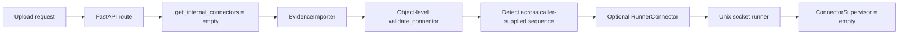
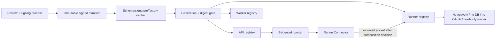

# Security Hardening Proposal: reviewable Connector manifest governance

## Decision

We should not enable the upload route merely by filling the current empty
`get_internal_connectors()` dependency. I inspected the Connector protocol,
importer selection path, runner supervisor and Compose mounts at revision
`48c6957`. The code validates individual Connector objects well, but no single
owned artifact says which implementations are enabled, which source systems
they own, which execution mode they require, or whether the API, worker and
runner agree on the same generation.

I recommend **Option 2: a signed declarative manifest with an allowlisted
factory map and runner-only production entries** for any future real Connector.
**Option 1: a static built-in manifest** is a sensible first development step
and can be used for synthetic fixtures, but it leaves deployment drift and code
review as the main identity control. An external dynamic registry is deferred;
it would introduce a control plane before this project has a remote ingestion
requirement.

## Executive Recommendation

The complete option set is:

1. **Option 1 — Static built-in manifest:** a versioned code-owned tuple of
   allowlisted factories is validated at startup and requires restart to change.
2. **Option 2 — Signed declarative manifest plus runner:** a signed immutable
   manifest selects only built-in factory IDs, pins connector identity and
   source-system ownership, and is loaded consistently by API/worker/runner.

I recommend Option 2 for a real Connector because it turns the enabled set into
an auditable deployment input and preserves the existing no-network runner
boundary. Option 1 should win for short-lived synthetic tests or when signature
key management is not yet available; it should not become an unreviewed
production registry by convenience.

## Evidence

| Evidence | Finding or source | What it establishes |
| --- | --- | --- |
| `A01` | `src/ledgerbridge/main.py` — empty route dependency | The route has no reviewed Connector manifest and fails closed by returning an empty sequence. |
| `A03` | `src/ledgerbridge/connectors.py` — contract validators | Individual objects are checked for identity, source system, execution mode and record shape; validation is not a manifest policy. |
| `A04` | `src/ledgerbridge/imports.py` — connector set and detection | The importer validates uniqueness, detects across the supplied sequence, and binds source system after a match. |
| `A05` | `src/ledgerbridge/connector_runner.py` — empty runner registry | The runner is bounded and no-network, but its production supervisor starts without a manifest unless one is injected. |
| `A06` | `src/ledgerbridge/runner_client.py` — runner facade | Runner-backed connectors can preserve the existing Connector shape, but need a composition-owned socket and registry. |
| `A07` | `src/ledgerbridge/worker.py` — current composition root | The worker builds an importer but does not load or distribute Connector identities. |
| `A08` | `docker-compose.yml` — mount and profile topology | The runner is optional and no-network; worker mounts the socket while API does not. |
| `A10` | `docker/connector-runner.Dockerfile` — runner privileges | The runner image is a suitable low-privilege execution boundary, not a manifest authority. |
| `A11` | Slice C upload-boundary design | Request values must not choose a Connector or `source_system`; production must fail closed without a reviewed manifest. |

## Current Design And Failure Mode

The current importer receives a `Sequence[Connector]` from its caller. It
validates each object's name, version, source system and execution mode, rejects
duplicates, detects matches, and uses the matched binding to create import
state. That is a strong local contract. The missing control is the answer to a
different question: which objects are allowed to exist in the sequence at all?

At present the HTTP dependency returns `()`, and the runner supervisor also
starts with `{}`. Tests can inject synthetic connectors, but no production
composition root loads a reviewed set. If a future caller simply constructs a
Connector from request metadata or imports an arbitrary Python path, the local
validator would not establish provenance, code identity, capability limits or
deployment consistency. Conversely, if API and worker load different sets, a
detected connector may be unavailable at the next stage or a source system may
be interpreted by an unintended implementation.

We therefore infer a manifest ownership gap: object-level validation is present,
but enablement, code selection, source-system ownership and generation agreement
are dispersed across composition roots. The runner's no-network boundary limits
blast radius, yet it cannot decide which code it should execute.

## Desired Invariants

- No request field selects a Connector name, version, factory or source system.
  The request supplies only a registered `ingest_channel`; detection chooses
  among the server-owned manifest entries.
- Every enabled entry has a unique `(name, version)`, one canonical
  `source_system`, one allowlisted `factory_id`, a supported protocol version,
  an explicit `execution_mode`, and bounded media/size policy.
- Production entries are runner-only. In-process synthetic connectors cannot
  enter a production manifest, even if they satisfy the Python protocol.
- API, worker and runner either load the same manifest generation/digest or fail
  closed before accepting evidence. A partial or mixed generation is not a
  valid deployment.
- Manifest signature, schema, factory, source registry, duplicate identity,
  image/code digest and capability declarations are verified before any import
  body is read or Connector code runs.
- The runner receives no database, artifact, OAuth or network authority; the
  manifest cannot grant a capability that the Compose boundary does not permit.
- Manifest changes are immutable deployment events with review, rollback and
  observability. No hot reload occurs during an active import.

## Constraints And Non-Goals

The production runner profile is currently optional, network-disabled and
low-privilege. The API does not mount the runner socket, so a synchronous API
route cannot claim runner-backed production support without a deliberate Compose
change. The database source-system registry is append-only and request values do
not create rows. We have no signing-key service, real parser, real Connector,
manifest file or measured reload/latency requirement. This design does not add a
Connector, sign a production artifact, or authorize evidence ingestion.

## Before Architecture



The dashed conceptual path is not a functioning production data path today:
the route is off, the manifest is empty, and API has no socket mount. That is
why the design must treat composition and deployment identity as first-class
controls rather than just instantiate another object.

## Options

### Option 1: Static built-in manifest

Option 1 defines a code-owned registry such as a tuple of factory IDs and
metadata. The composition root maps each factory ID to a fixed constructor,
constructs the object, calls `validate_connector(production=...)`, verifies the
database source-system row exists, rejects duplicate identities, and exposes the
same tuple to the route and worker. Production still requires
`execution_mode=runner`; the runner image imports the same allowlisted factory
set. Changes require a code review and image restart.

This is the smallest safe step for synthetic or a single internally reviewed
Connector. It preserves Python ergonomics and avoids a signature/key service.
The concern is that the enabled set is implicit in code and image identity. A
configuration-only audit cannot answer which factory a running container used,
and API/worker/runner can drift if their images are not pinned to the same
revision. We would need startup logs containing a manifest digest and a strict
revision equality check to keep the residual risk visible.


| Change | Before | After | Security consequence | Cost |
| --- | --- | --- | --- | --- |
| Enablement owner | Caller-supplied sequence | Code-owned factory map | Removes request-selected code | Requires code review/rebuild |
| Identity | Per-object validation only | Startup manifest digest and uniqueness | Makes drift observable | Digest/version plumbing |
| Production mode | Validator rejects in-process | Manifest requires runner mode | Preserves process isolation | Socket/image composition work |
| Availability | Empty registry everywhere | Startup fails closed on invalid set | Avoids partial enablement | Bad manifest blocks startup |

This option is easy to roll back by deploying the empty manifest or reverting
the code revision. It is not a good long-lived control if we need independent
operations, attestations or frequent connector updates.

### Option 2: Signed declarative manifest plus runner

Option 2 stores an immutable, signed manifest outside application source but
inside the reviewed deployment artifact. A verifier checks the signature and
schema before parsing entries. The entry contains at least:

```text
manifest_schema
generation
factory_id              # maps only to a built-in allowlist
connector_name
connector_version
source_system
execution_mode          # runner in production
runner_protocol_version
connector_code_digest   # or immutable image/package digest
allowed_media_types
max_artifact_bytes
capabilities             # declarative, then cross-checked with Compose
```

The loader rejects unknown factory IDs, duplicate identities, non-canonical
source systems, unsupported protocol versions, unregistered source systems,
in-process production entries, and capability claims that exceed the runtime
boundary. API, worker and runner report the same generation and digest; a
mismatch keeps the route unavailable. The runner executes only the allowlisted
factory and remains network-disabled, read-only and credential-free. A manifest
reload is an explicit restart/deployment, never an in-place mutation during an
import.

The attractive part is the clear deployment fact: reviewers can inspect the
manifest, signature, factory allowlist and code/image digest without reverse
engineering a Python module. We can rotate a connector version as an immutable
generation and roll back by selecting the previous signed generation. The costs
are real: key custody, signature verification, canonical serialization,
generation distribution, and a composition change so API can reach the runner
socket or the route becomes asynchronous. What gives me pause is not the
signature itself; it is the temptation to treat a valid signature as permission
to grant capabilities. The loader must still cross-check code, source registry,
runner protocol and Compose isolation.



| Change | Before | After | Security consequence | Cost |
| --- | --- | --- | --- | --- |
| Enablement owner | Empty or caller sequence | Signed immutable deployment input | Makes who/what is enabled auditable | Signing workflow and key custody |
| Code identity | Python object at runtime | Factory allowlist plus code/image digest | Narrows substitution and drift | Build metadata and digest checks |
| Cross-service state | No generation agreement | API/worker/runner must match digest | Prevents mixed connector semantics | Startup coordination and health checks |
| Capability boundary | Runtime convention | Manifest claim cross-checked with Compose | Prevents policy-only privilege inflation | Schema and deployment validation |
| Update/rollback | Code/image redeploy only | Signed generation selection | Fast, reviewable rollback | Manifest distribution tooling |

Option 2 keeps the runner's bounded protocol and no-network boundary; the
manifest does not move evidence or credentials into the runner. It does add a
new failure mode where a missing signing key or mismatched generation disables
ingestion, which is preferable to silently running an unreviewed parser. We can
roll back to the previous signed generation or to the empty manifest without
changing database data.

## Comparison

| Dimension | Option 1 — static built-in | Option 2 — signed declarative + runner |
| --- | --- | --- |
| Security | Improves caller selection; source of truth remains code/image | Stronger deployment provenance and generation agreement |
| Performance | Startup construction only; no signature/key lookup | Startup signature/schema/digest work; request path stays local/socket-bounded |
| Memory | Small tuple and objects | Bounded manifest plus verifier/key material |
| Reliability | Fewer dependencies; image drift can be silent | Fail-closed on invalid/mixed generation; signing service becomes rollout dependency |
| Operability | Code review and image rollback | Manifest review, signatures, digest telemetry and key rotation |
| Migration | Minimal; best for synthetic fixtures | Requires manifest pipeline and explicit API-to-runner socket/async decision |

Option 1 is proportionate if the only goal is a test connector and we can pin
all images to one revision. Option 2 becomes preferable when a real connector,
multiple versions, or independent review is in scope. An external dynamic
registry remains deferred because it would add network reachability and a new
control plane without a demonstrated need.

## Recommendation

I recommend Option 2 for the first real Connector and Option 1 only as a
temporary synthetic/test implementation. The signed manifest should be loaded
at startup by every process that can select or execute a connector, and the
route should remain unavailable until the API/runner composition decision is
made. If the project cannot yet operate signing keys, we should implement the
same manifest schema and factory allowlist in Option 1, emit a deterministic
digest, and keep production empty rather than weakening the boundary.

## Evidence Coverage And Residual Risk

| Evidence | Effect | Tactical control still required |
| --- | --- | --- |
| `A01` — empty route dependency | addresses | Keep empty manifest fail-closed until loader and registry tests pass. |
| `A03` — object contract validation | mitigates | Retain validator after manifest loading; it is not replaced by signature verification. |
| `A04` — importer detection and source binding | addresses | Keep request from selecting Connector/source system; validate source registry before startup. |
| `A05` — empty runner supervisor | addresses | Load only allowlisted factories and assert generation/digest before serving. |
| `A06` — runner facade | mitigates | Decide API socket mount or asynchronous worker handoff before production sync route. |
| `A07` — worker composition gap | addresses | Add one shared composition loader and compare digests across API/worker/runner. |
| `A08` — Compose isolation | mitigates | Preserve no-network/read-only/cap-drop runner; test manifest capabilities against actual mounts. |
| `A10` — runner image boundary | mitigates | Pin image/code digest in the manifest and keep credentials out of the image. |
| `A11` — approved upload contract | addresses | Keep all connector selection server-owned and feature flag closed during rollout. |

Residual risks include a compromised signing process, a malicious but
allowlisted factory, a stale source-system registry, and an API/runner socket
composition that accidentally grants more authority than the manifest claims.
The manifest reduces drift; it does not replace code review, runner isolation,
or the connector contract validator.

## Migration And Rollout

First define the schema, canonical serialization and factory allowlist with an
empty production manifest. Add startup validation and digest telemetry without
enabling the route. Next load one synthetic connector in test and replay the
existing importer/runner tests. Before any real connector, register its
`source_system` through the owner-only migration path, build a runner image with
an immutable digest, sign a manifest generation, and decide whether the API
mounts the Unix socket or enqueues work to the worker.

Roll out by generation: deploy the verifier and empty manifest, then a signed
manifest in a non-production profile, then a guarded production profile only
after independent authorization. Roll back by selecting the previous signed
generation or empty manifest and restarting all three consumers. Never hot-swap
the object sequence while an import is reading an artifact.

## Validation Plan

- Schema/property tests for duplicate identities, unknown factory IDs, invalid
  signatures, canonical serialization changes, unsupported protocol versions,
  source-system mismatches, in-process production entries and capability drift.
- Cross-process test that API, worker and runner reject differing generation or
  manifest digest and that empty/invalid manifests produce no import/audit side
  effect.
- Runner tests prove network-disabled, read-only, no-credential operation and
  that a valid signature cannot grant a database, artifact or OAuth capability.
- Importer tests prove request `ingest_channel` never selects connector name,
  version or source system, and that detection ambiguity remains `NEEDS_REVIEW`.
- Compose/Linux replay with the API socket decision explicitly exercised; test
  both the synchronous mounted-socket path and the deferred worker path before
  choosing one.
- Measure startup time, manifest memory, connector detection latency and socket
  backpressure for one and many entries; no performance result is claimed here.

## Implementation Work Packages

- Define a canonical manifest schema and a deterministic digest; keep signature
  verification and key references outside the repository.
- Define `ConnectorFactory` allowlist and one shared loader used by API, worker
  and runner; retain `validate_connector` as a second defense.
- Add startup checks for source-system/ingest-channel registry presence,
  protocol version, production runner mode, unique identity and digest equality.
- Add manifest generation to health/diagnostic output without exposing raw
  manifest contents or signing material.
- Resolve the API-to-runner composition: mount `connector-socket` only with an
  explicit security review, or change the route to a worker-owned async handoff.
- Add deployment tests, signed test fixtures, rollback documentation and a
  fail-closed empty-manifest default.

## Open Questions

- Where will the signing key and verification key be managed, rotated and
  revoked without placing credentials in the repository or runner image?
- Will the first production import remain synchronous, requiring an API socket
  mount, or move connector execution to the worker asynchronously?
- What owner approves a new `source_system`, factory ID and parser version?
- Should a manifest entry pin a Python package digest, a runner image digest, or
  both?
- What is the accepted behavior when the database registry contains a source
  system that the signed manifest no longer declares?
