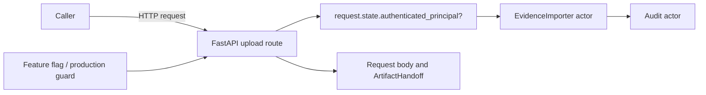
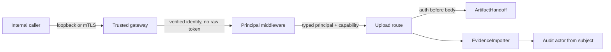
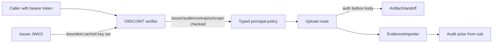

# Security Hardening Proposal: trusted principal admission for evidence upload

## Decision

We should keep the upload route disabled until a provider-backed principal can
be established before the request body is read. I inspected the route and its
composition root at revision `48c6957`; the current `request.state` value is a
deliberate seam for tests and trusted middleware, not an authentication system.

For the current internal/test-only phase, I recommend **Option 1: a trusted
internal gateway/middleware boundary**. It gives us a small, reviewable change
that fits the loopback-only Hermes posture and leaves the route default-off. If
we later allow remote or multi-client callers, **Option 2: an in-process OIDC/JWT
verifier** becomes preferable because the service can evaluate audience, scope,
expiry and tenant policy without trusting a transport-only identity. We should
not treat the short-term option as sufficient for public exposure.

## Executive Recommendation

The complete option set is:

1. **Option 1 — Trusted internal gateway/middleware:** a loopback or mTLS
   boundary verifies the caller and installs a typed principal in request state.
2. **Option 2 — OIDC/JWT verifier in the API boundary:** the API verifies a
   bearer token against a pinned issuer/audience and maps an allowed scope to a
   typed principal.

I recommend Option 1 under today’s constraints because the route is internal,
production-disabled, and not authorized for real evidence. Option 2 should win
before any remote client, browser, or multi-tenant workflow is introduced. The
choice is driven by exposure, not by a claim that either provider has already
been selected.

## Evidence

| Evidence | Finding or source | What it establishes |
| --- | --- | --- |
| `A01` | `src/ledgerbridge/main.py` — principal seam and route gate | The route reads only `request.state.authenticated_principal`, checks bounded storable text, and has no verifier or scope policy. |
| `A02` | Internal upload implementation evidence | The principal is explicitly described as a later trusted-middleware seam; client actor headers are not authoritative. |
| `A07` | `src/ledgerbridge/worker.py` — composition root | The current runtime composition has no authentication provider factory. |
| `A08` | `docker-compose.yml` — ingress and production defaults | API ingress is loopback-published, while the production-default feature flag is false. |
| `A11` | Slice C upload-boundary design | Authentication must happen before body read and actor must be server-derived; provider integration is a separate gate. |
| `A12` | `src/ledgerbridge/config.py` — settings | No issuer, audience, JWKS, certificate-policy or scope settings exist in the source snapshot. |

## Current Design And Failure Mode

The request path currently has a useful ordering property: the feature flag and
production guard run before authentication and body read. Once the flag is
enabled in a non-production test profile, however, `get_authenticated_principal`
accepts any non-empty storable string already placed into `request.state`. No
code proves who placed it there, whether it is fresh, what audience it was
issued for, or whether the caller may write evidence. A future middleware could
fill the state correctly, but that contract is only conventional today.

The structural condition is therefore an authority gap rather than a missing
string check. The route has an actor field at the audit boundary, but it does
not yet own the proof that the actor is authenticated and authorized. If a
future adapter copies an untrusted header into state, the audit chain would
record a syntactically safe attacker-selected actor. The existing text
predicate would not detect that semantic substitution.

## Desired Invariants

We should make the following behaviors falsifiable before enabling the route:

- Authentication and authorization complete before any request body byte is
  consumed or any staging session is opened.
- Only a verifier-owned typed principal can reach the importer; raw headers,
  query parameters, filenames and multipart fields cannot choose the actor.
- The principal has a canonical subject, issuer, audience, authentication time,
  expiry and capability set; audit actor is derived from the canonical subject.
- Missing, expired, wrong-audience, wrong-issuer, malformed, revoked-by-policy or
  insufficient-scope credentials fail closed with one bounded code and no token
  or provider detail in logs or responses.
- Provider key refresh and outage behavior has an explicit bounded policy. A
  stale key cache cannot silently authorize an unknown key or extend token
  expiry.
- Test fixtures can inject a principal only through dependency overrides or a
  test provider, never through a client-controlled header that production code
  also accepts.

## Constraints And Non-Goals

The current route is internal/test-only and default-disabled. Hermes production
must remain unchanged. We have no selected identity provider, no secrets in the
repository, no remote exposure requirement, and no measured latency budget.
The design does not choose an OAuth vendor, add a user database, or authorize a
production deployment. It also does not solve Connector manifest governance;
that is the companion proposal.

## Before Architecture

The existing trust boundary is shown at the same level of abstraction as both
candidate designs. The dashed state edge is a convention rather than a verified
authentication result.

The concern is not that the current route accepts a client actor header—it does
not. The concern is that the state value has no owned producer. That distinction
lets us preserve the good route ordering while changing who is allowed to create
the principal.

## Options

### Option 1: Trusted internal gateway/middleware

Option 1 keeps the API's existing state seam but makes its producer explicit.
For the Hermes/internal profile, a loopback-only gateway or mTLS-terminating
proxy authenticates the caller, maps a certificate SAN or a verified internal
identity to a canonical subject, and invokes an ASGI middleware that installs a
typed `AuthenticatedPrincipal`. The API never trusts a raw `X-Actor` header. In
test mode, a dependency override supplies the same typed object without opening
the network path.

The attractive part is its small authority surface: the API does not need to
fetch keys or parse bearer tokens, and the existing body-before-auth ordering
remains easy to test. What gives me pause is the dependency on a correctly
configured transport boundary. A proxy misroute, certificate policy drift, or
accidental direct exposure could turn the state seam back into convention. We
would therefore bind the listener to loopback, require mTLS for any non-loopback
hop, reject direct identity headers, and expose a startup diagnostic containing
only the provider-policy generation and hash.

| Change | Before | After | Security consequence | Cost |
| --- | --- | --- | --- | --- |
| Identity producer | Unowned request state | Gateway/middleware policy | Removes client/header substitution path | Proxy policy and certificate operations |
| Authorization | Presence and text only | Capability check before body read | Prevents authenticated-but-unapproved callers | New policy mapping and tests |
| Exposure | Loopback port plus future ingress risk | Loopback-only or mTLS-only | Narrows network trust boundary | Limits ad-hoc clients |
| Failure | Missing state becomes 401 | Gateway and middleware fail closed | No body/staging side effect | Gateway availability becomes a prerequisite |

This option preserves the synchronous route and avoids a new copy of evidence.
It does not, by itself, give us portable user authentication or a standard
remote-client token contract. Rollback is straightforward: keep the flag false,
remove the middleware binding, and retain the route dependency seam for tests.

### Option 2: OIDC/JWT verifier in the API boundary

Option 2 makes the API boundary the verifier. An ASGI middleware or dependency
extracts a bearer token, verifies an explicitly configured issuer, audience,
algorithm allowlist, signature and bounded clock skew against a cached JWKS, and
maps `sub` plus a tenant/provider namespace into `AuthenticatedPrincipal`. A
separate policy dependency requires a scope such as `evidence:write` and any
future tenant/resource constraint. The verifier runs before the request stream
is consumed; raw tokens are never placed in request state or logs.

This is the stronger long-term contract when callers are no longer a single
internal service. We can test the policy independently from FastAPI and rotate
keys through the provider's JWKS. The material cost is operational: issuer and
JWKS configuration, bounded cache refresh, clock discipline, outage semantics,
and a security review of algorithm and claim handling. We must choose whether a
known key remains usable during a short JWKS outage; that decision cannot be
hidden in a library default. Under the present default-off posture, this option
would be unnecessary complexity unless a remote exposure decision is made.

| Change | Before | After | Security consequence | Cost |
| --- | --- | --- | --- | --- |
| Credential proof | Unowned state convention | Signature and claim verification | Makes identity and audience falsifiable | JWKS cache, clock and rotation logic |
| Authorization | No capability claim | Explicit scope/tenant policy | Separates authentication from write authority | Provider policy coordination |
| Availability | No provider dependency | Bounded verifier/JWKS dependency | Fail-closed outage behavior is explicit | Possible upload denial during provider/key outage |
| Observability | No auth generation | Provider/issuer/key IDs without raw token | Supports audit without secret leakage | New metrics and redaction rules |

The option preserves the current importer and handoff ownership, but it adds a
new key-management failure mode. We would roll it out in shadow verification,
then require the verifier only for a non-production profile, and finally keep a
production feature flag separate from provider rollout. Rollback is a policy
switch to the trusted internal profile, never an acceptance of arbitrary headers.

## Comparison

| Dimension | Option 1 — trusted internal gateway | Option 2 — OIDC/JWT verifier |
| --- | --- | --- |
| Security | Improves internal provenance; transport policy remains critical | Stronger portable proof and claim policy; verifier/key bugs become critical |
| Performance | One local middleware/proxy hop; no JWKS lookup on request | Token verification plus bounded key-cache lookup on each request |
| Memory | Small typed principal and gateway state | Bounded JWKS cache and token claims |
| Reliability | Depends on gateway/certificate availability | Depends on provider key availability and clock correctness |
| Operability | Certificate/SAN mapping and proxy policy | Issuer/audience/JWKS rotation, metrics and outage runbook |
| Migration | Minimal route change; ideal for current internal profile | More configuration and provider coordination; better remote path |

No composite score is useful here. The exposure decision is the discriminator:
Option 1 is proportionate while the route is loopback/internal and off by
default; Option 2 becomes preferable when we need a standard caller contract or
multiple independent clients.

## Recommendation

I recommend Option 1 as the first implementation seam, with the typed principal
and capability model shaped so Option 2 can replace only the verifier. We should
not add a raw-header fallback. Before any real evidence path, we should either
complete the gateway/mTLS policy for the intended deployment or select an OIDC
issuer and implement Option 2; the feature flag must remain off until then.

## Evidence Coverage And Residual Risk

| Evidence | Effect | Tactical control still required |
| --- | --- | --- |
| `A01` — route principal seam | mitigates | Keep dependency override-only in tests; add verifier-owned producer before enablement. |
| `A02` — route evidence and residual gate | addresses | Preserve client actor-header rejection and bounded response. |
| `A07` — worker composition root | unaffected | Add provider configuration to the API composition root without placing secrets in the repository. |
| `A08` — compose exposure and defaults | mitigates | Keep loopback binding and production flag false; test direct-container access. |
| `A11` — approved upload contract | addresses | Authenticate before body read and derive actor server-side. |
| `A12` — missing provider settings | addresses | Add explicit schema validation and fail startup or route closed on incomplete policy. |

Residual risk remains if the gateway is bypassed, if certificate-to-subject
mapping is stale, or if a future route accepts a header outside this dependency.
The route's default-off and production-forced-off controls remain necessary even
after a provider is implemented.

## Migration And Rollout

We can introduce the typed principal model and policy object with no production
behavior change. Next, add a non-production verifier and tests that prove body
bytes and staging remain untouched for every failed credential case. For an
internal Hermes profile, bind only loopback or an mTLS gateway, run shadow
identity checks, and compare policy-generation telemetry. Do not enable the
production flag as part of provider rollout. If a future remote exposure is
approved, add OIDC verification behind a distinct configuration and review gate.

Rollback is a configuration and deployment rollback: keep the route closed,
remove the provider binding, and leave the importer/handoff code unchanged. We
must not roll back by accepting a client actor header.

## Validation Plan

- Unit-test issuer, audience, algorithm, expiry, clock-skew, scope, tenant,
  malformed-token, unknown-key and JWKS-outage cases with bounded diagnostics.
- Route-test every rejection before body read, including a streaming body that
  would fail if consumed, and assert no staging directory or artifact row.
- Test canonical subject mapping and audit actor values with NUL, surrogate,
  overlong and Unicode edge cases.
- Run an integration profile with a local ephemeral gateway or test issuer;
  do not use production tokens or provider secrets.
- Verify direct API access without the gateway fails closed and that logs contain
  no raw authorization header or token.
- Measure p50/p95 auth latency and peak RSS with a cold and warm key cache before
  selecting Option 2 for remote exposure; no measurement is claimed here.

## Implementation Work Packages

- Define `AuthenticatedPrincipal` and `AuthPolicy` as internal types; keep actor
  serialization bounded and storable.
- Implement one provider adapter (trusted internal first, OIDC only after the
  exposure decision) and a route dependency requiring `evidence:write`.
- Remove any future temptation to read `X-Actor`/`X-Reason` by adding a negative
  test and a sensitive-header log scan.
- Add settings validation for provider mode, issuer/audience or gateway policy,
  clock skew, and cache limits; keep all secrets outside the repository.
- Add compose wiring and a rollback switch without changing the production
  default-off invariant.

## Open Questions

- Which internal gateway or identity provider is approved for Hermes, if any?
- Is the first authorized caller a single service identity, a human operator,
  or a tenant-scoped automation principal?
- What exact capability and tenant claims are required before any real evidence
  import is authorized?
- What JWKS outage and key-revocation window is acceptable for Option 2?
